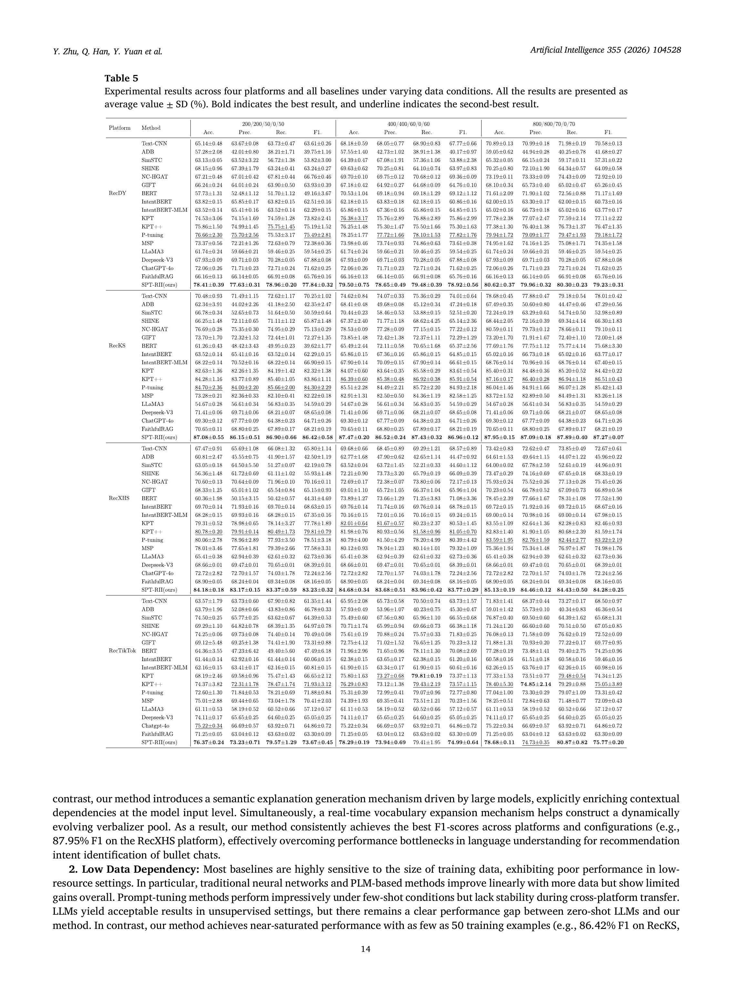

# BC4RII Paper Reader (Draft)

> Source: Zhu et al., *Artificial Intelligence* 355 (2026) 104528, DOI: 10.1016/j.artint.2026.104528.
> Mode: full extracted text with stable page/block anchors. Chinese translations marked as review-needed are intentionally not fabricated.

## Experimental takeaways

- RecDY Table 5 reports SPT-RII Macro-F1 of 77.84±0.32, 78.92±0.56 and 79.23±0.31 for 50/60/70 examples per class (source: p.14, Table 5).
- The paper uses a 20-comment historical window and combines LLM explanation generation, soft prompts and dynamic verbalizer updates (source: p.9–10, S0030–S0045; anchors depend on extracted layout).
- This workspace's comparison is explicitly a lower-cost substitute, not an exact SPT-RII reproduction.

## Page-by-page bilingual text

## Page 1

**Source:** p.1 S0001

**Original:** Contents lists available at ScienceDirect

**中文:** 【中文译文待核对】本块原文已完整保留；本次实验报告优先核对了数据协议、Table 5 数值和方法边界。

**Source:** p.1 S0002

**Original:** Artificial Intelligence journal homepage: www.elsevier.com/locate/artint

**中文:** 【中文译文待核对】本块原文已完整保留；本次实验报告优先核对了数据协议、Table 5 数值和方法边界。

**Source:** p.1 S0003

**Original:** Analyzing bullet chats for recommendation intent identification: Dataset and method Yi Zhu a,b,c , Qinqin Han a , Yunhao Yuan a , Chaowei Zhang a , Jipeng Qiang a,∗, Xindong Wu b,c,∗ School of Information Engineering, Yangzhou University, Yangzhou, China Ministry of Education, Key Laboratory of Knowledge Engineering with Big Data (Hefei University of Technology), Hefei, China c School of Computer Science and Information Engineering, Hefei University of Technology, Hefei, China a

**中文:** 【中文译文待核对】本块原文已完整保留；本次实验报告优先核对了数据协议、Table 5 数值和方法边界。

**Source:** p.1 S0004

**Original:** b

**中文:** 【中文译文待核对】本块原文已完整保留；本次实验报告优先核对了数据协议、Table 5 数值和方法边界。

**Source:** p.1 S0005

**Original:** a r t i c l e

**中文:** 【中文译文待核对】本块原文已完整保留；本次实验报告优先核对了数据协议、Table 5 数值和方法边界。

**Source:** p.1 S0006

**Original:** i n f o

**中文:** 【中文译文待核对】本块原文已完整保留；本次实验报告优先核对了数据协议、Table 5 数值和方法边界。

**Source:** p.1 S0007

**Original:** Keywords: Bullet chats Live-streaming sales Recommendation intent identification Soft prompt-tuning Verbalizer

**中文:** 【中文译文待核对】本块原文已完整保留；本次实验报告优先核对了数据协议、Table 5 数值和方法边界。

**Source:** p.1 S0008

**Original:** a b s t r a c t Live-streaming sales (LS) have emerged as a major e-commerce model particularly in China, with bullet chats serving as the primary channel for audience interaction. Bullet chats refer to realtime scrolling comments, these short, fast-flowing messages create unique analytical challenges, particularly for sellers who must identify and respond to key messages promptly. In this paper, we present the first investigation on bullet chats for live-streaming sales, with a focus on the critical task of Recommendation Intent Identification (RII), i.e., determining whether a bullet chat reflects a recommendation-seeking intent or is merely casual commentary. Specifically, we construct and release the first publicly available benchmark dataset for RII, termed BC4RII, which comprises 0.14 million bullet chats collected from four mainstream LS platforms. Furthermore, we propose SPT-RII, an advanced method on the ground of soft prompt-tuning tailored for the RII task. SPTRII enriches sparse bullet-chat semantics through explanation generation and adapts to streaming input via a dynamic vocabulary update mechanism. Experimental results demonstrate that our method significantly outperforms state-of-the-art baselines, including large language models. To the best of our knowledge, this is the first comprehensive study analyzing bullet chats for RII on live-streaming sales, which establishes a foundational resource and method for real-time intent understanding in live-streaming sales.

**中文:** 直播销售（LS）已经成为重要的电子商务形态，弹幕是观众与主播互动的主要渠道。论文将推荐意图识别（RII）定义为判断弹幕是否表达寻求商品推荐的意图，并构建了 BC4RII 数据集与 SPT-RII 方法。

**Source:** p.1 S0009

**Original:** 1. Introduction Live-streaming Sales (LS) have shown to be an extremely helpful mode to increase product sales in e-commerce, especially in China [1,2]. On June 1, 2025, Gree Company achieved a new record of $908 million in single-day sales through live-streaming campaigns. According to the data from the State Administration for Market Regulation1 in China, the total transaction volume of LS reached $627.4 billion in 2024, accounting for nearly one-third of China’s online retail sales and contributing 80% to the growth of e-commerce. They further predict that LS revenue will exceed $700 billion by 2025, indicating substantial potential for continued expansion. On online live-streaming platforms, a distinctive form of interaction known as "bullet chats" has emerged, differing from conventional comment systems by enabling real-time, dynamic engagement between audiences and sellers [3]. As shown in Fig. 1, ∗

**中文:** 【中文译文待核对】本块原文已完整保留；本次实验报告优先核对了数据协议、Table 5 数值和方法边界。

**Source:** p.1 S0010

**Original:** Corresponding author. E-mail addresses: zhuyi@yzu.edu.cn (Y. Zhu), mz120241003@stu.yzu.edu.cn (Q. Han), yhyuan@yzu.edu.cn (Y. Yuan), cwzhang@yzu.edu.cn (C. Zhang), jpqiang@yzu.edu.cn (J. Qiang), xwu@hfut.edu.cn (X. Wu). 1 http://www.xinhuanet.com/tech/20250710/c1b5c1ba5a154aa6a0b3175c067483fb/c.html https://doi.org/10.1016/j.artint.2026.104528 Received 11 August 2025; Received in revised form 28 February 2026; Accepted 26 March 2026 Available online 2 April 2026 0004-3702/© 2026 Elsevier B.V. All rights are reserved, including those for text and data mining, AI training, and similar technologies.

**中文:** 【中文译文待核对】本块原文已完整保留；本次实验报告优先核对了数据协议、Table 5 数值和方法边界。

## Page 2

**Source:** p.2 S0011

**Original:** Fig. 1. An illustration for bullet chats of live-streaming sales. The goal of our study is to determine whether a bullet chat reflects a recommendationseeking intent or is merely casual chat.

**中文:** 图注已保留；中文译文待核对。

**Source:** p.2 S0012

**Original:** bullet chats consist of scrolling comments posted by audiences that appear on the screen for others and sellers to see during the live-streaming. This feature allows audiences to ask immediate questions and provide real-time feedback, fostering an interactive and immersive shopping experience. By 2025, bullet chats have been integrated into the majority of live-streaming sales, with the total number exceeding 100 billion [4]. Previous studies on bullet chats in live-streaming sales primarily focus on analyzing how to utilize these live chats to boost sales performance [2,5]. For example, Fan et al. find that interacting with bullet chats in different modes, such as hiring influential streamers and utilizing merchant live-streaming, can have varying impacts on sales [2]. However, with the growing popularity of live-streaming sales, a single session of streaming may generate tens of thousands of bullet chats [6]. Effectively utilizing these chats first requires distinguishing which messages warrant a response. In practice, sellers must promptly identify and address key inquiries during the stream, as responding to all audience messages is both resource-intensive and unnecessary. For example, consider the following two bullet chats: "The live streamer is so nice" and "Does this dress come in XL size?", only the latter contains a product-related query that should be flagged and integrated into the recommendation system. The former is a casual remark that does not require a response. Therefore, a critical challenge in live-streaming sales is to determine whether a bullet chat expresses recommendation-seeking intent or merely casual commentary. More precisely, in this paper, we focus on the research problem as follows: RQ: Recommendation Intent Identification (RII): determining whether a bullet chat reflects a recommendation-seeking intent or is merely casual chat. To the best of our knowledge, there has been no comprehensive analysis of the RII task from the perspective of bullet chats. In this paper, we constructed the first publicly available bullet chats dataset for RII, termed BC4RII, which comprises 0.14 million bullet chats collected between January and March 2025 across four mainstream platforms: Douyin, Kuaishou, Xiaohongshu, and TikTok. Specifically, we first propose an ensemble method that integrates three RII methods based on explanation generation to produce highquality pseudo labels. This automated labeling process significantly reduces the annotation workload by generating both potential labels and corresponding explanations. Subsequently, human annotators review and verify these pseudo labels. This collaborative method harnesses the expertise of human annotators while leveraging the efficiency and scalability of machine-generated labels. All these efficiencies allow for the creation of a larger dataset within a reasonable budget. In the LS, bullet chats are extremely short, often comprising only a few words, and their meaning frequently depends on the surrounding conversational context. Moreover, the real-time streaming nature of LS causes rapid shifts in product focus and audience attention, leading to continuous semantic drift. Existing methods that ranged from neural network classifiers to pre-trained language models (PLMs) and large language models (LLMs) struggle in such settings. Traditional classifiers rely heavily on surface features and fixed vocabularies, making them unsuitable for sparse or evolving semantics. PLMs lack the ability to reason over fragmented text and cannot dynamically incorporate new intent-related expressions. Although LLMs possess strong generalization capabilities, their inability to update in real time limit their practicality in high-frequency LS environments. To address these challenges, based on the constructed BC4RII dataset, we further propose a Soft Prompt-tuning method for the RII task (short for SPT-RII), which reformulates tasks as natural language prompts to be completed by PLMs. Soft prompts provide a flexible mechanism for injecting task-specific semantics into PLMs without full model fine-tuning. Specifically, to address the issue of 2

**中文:** 【中文译文待核对】本块原文已完整保留；本次实验报告优先核对了数据协议、Table 5 数值和方法边界。

## Page 3

**Source:** p.3 S0013

**Original:** feature sparsity caused by the extremely short bullet chats, we first conduct explanation enhancement with LLMs, thereby enriching semantic context and compensating for limited intent representation. Secondly, given the real-time and evolving nature of bullet chats, we designed a dynamic update mechanism for the soft prompt-tuning model, which continuously refreshes the vocabulary pool to address semantic anchor dilution and concept drift. Experimental results demonstrate the effectiveness of our SPT-RII method compared to the baselines, including the SOTA LLMs. The main contributions of this paper are as follows: (1) We address the recommendation intent identification in live-streaming sales and create the first publicly available benchmark dataset of bullet chats, manually annotated for this purpose. Notably, our BC4RII dataset construction method offers a scalable and effective solution for building large, high-coverage datasets, particularly for identification tasks with ambiguous decision boundaries. (2) Unlike existing methods, we introduce an explanation enhancement module and a dynamic update mechanism to address the extremely short and real-time nature of bullet chats. (3) Experimental results confirm that the SPT-RII method outperforms baseline methods, including the SOTA LLMs. We believe our study can shed new light on solving the on live-streaming sales research from the perspective of bullet chats. The dataset and code are available at https://github.com/zhuyiYZU/BC4RII. 2. Related work 2.1. Live-streaming sales Live-streaming sales have reshaped the interaction between sellers and consumers [7], transforming traditional "shelf-style" ecommerce into an immersive experience that integrates socializing, entertainment, and shopping functions. In the scenario of livestreaming sales, consumers are no longer passive recipients of information but active participants who interact in real-time with the streamer and other audiences through bullet comments and other forms of engagement [8]. The rapid development of live-streaming sales largely benefits from the continuous construction of dedicated datasets. For example, the Real20M dataset targets cross-modal e-commerce retrieval [9], covering multi-modal information of products and short videos, supporting cross-domain association modeling between products and short videos based on user queries. This work focuses on the multi-modal retrieval across products and micro-videos, which has not yet paid attention to the new business model of live-streaming sales. Yang et al. proposed the large-scale multi-modal live product recognition dataset LPR4M [10], which has significantly advanced research in product recognition and recommendation tasks. This work just focuses on recognizing products in a live commerce clip, neglecting the most important interactions in LS, such as bullet comments. The LSEC dataset focuses on interactions among streamers, users, and products [11], constructing a heterogeneous graph in live-streaming sales, dedicated to user behavior analysis and personalized recommendation tasks. This dataset is still constructed following the intuition of traditional recommendation systems by analyzing streamers’ influence, without considering the real-time interaction characteristics in live-streaming sales. In contrast to existing works, in this paper, we create the first publicly available benchmark dataset of bullet chats in live-streaming sales, which can be a benchmark for recommendation intent identification and other related tasks in live-streaming sales. 2.2. Bullet chatting Bullet chatting, also known as danmu, is an innovative real-time commenting mechanism characterized by overlaying user comments as dynamic text directly on the video screen, synchronized with the timeline [12,13]. As shown in Fig. 1, bullet chatting allows viewers to ask immediate questions and share real-time feedback during live-streaming. Unlike traditional comment systems, such as YouTube’s comment section, bullet chatting enhances the sense of real-time interaction and user engagement [4]. Consequently, nearly all live-streaming platforms have adopted bullet chatting as a core feature [14], and it has emerged as a dynamic medium for users to express their emotions in a more timely, direct, and concentrated manner. The comments posted in bullet chatting, namely bullet chats, exhibit a high degree of fragmentation, emotionality, and collectivity in both form and semantics [15]. This distinctive linguistic style enhances emotional resonance and interactive stickiness among users, forming a vital part of the platform’s subcultural ecosystem [16]. In the context of live-streaming sales, users leverage bullet chats to provide real-time feedback on product experiences. For example, when a streamer showcases a product, audiences can quickly express questions or opinions regarding its price, functionality, or appearance via bullet chats. This "watch-and-chat" model shortens the decision-making process and can even directly influence purchasing behavior [17]. Moreover, the "trans-temporal" nature of bullet chatting, where past messages continue to appear on the current screen, further extends user viewing time, making bullet chats a valuable supplement to the video content itself [13]. Therefore, uncovering the implicit intentions within bullet chats in this paper is crucial for optimizing live-stream content recommendation systems, improving user experience, and boosting conversion rates. 2.3. Recommendation intent identification Different live-streaming sales platforms have built distinct ecosystems due to differences in their platform nature, user groups, and business models, which also bring different challenges. Taking Taobao Live as an example, as a live-streaming feature embedded within a traditional e-commerce website, its users typically enter the live room with clear shopping intentions, and their interactive behaviors are more focused on the products themselves [18]. Therefore, intent recognition models need to efficiently handle queries related to product specifications, features, and reviews [19]. In contrast, platforms like Douyin and Kuaishou focus on content and social interaction, making their live-streaming sales more entertainment-oriented and prone to impulse purchases [20]. 3

**中文:** 数据集和代码发布在 BC4RII 官方仓库中。

## Page 4

**Source:** p.4 S0014

**Original:** Fig. 2. Overall framework for constructing the BC4RII dataset, comprising data preparation, machine-generated pseudo labels, and manual annotation.

**中文:** 图注已保留；中文译文待核对。

**Source:** p.4 S0015

**Original:** These platforms often rely on promotional activities such as lotteries and coupon grabbing to extend user stay time and increase interaction rates. Against this backdrop, accurately identifying high-commercial-value interactive behaviors from massive amounts of general entertainment content and addressing the issue of highly homogeneous content have become key challenges that need urgent solutions. Unlike traditional recommendation systems that rely on users’ historical behavior for static prediction, intent-aware recommender systems aim to capture users’ current latent motivations [21]. Existing methods can be broadly categorized into two types: explicit and implicit intent modeling. Explicit intent modeling relies on signals actively expressed by users, such as search queries, click behavior, and product bookmarking [22]. For example, Wang et al. proposed an intent representation learning method based on LLMs to construct multi-modal intents [23]. In this method, a pairwise and translation alignment is proposed to eliminate intermodal differences, and a momentum distillation is employed to perform teacher-student learning on fused intent representations. Despite these achievements, most users’ behavioral data consists of implicit feedback, the explicit signals do not always accurately reflect the user’s true preferences. Thus, implicit methods are proposed, which focus on mining latent intentions from user behavior or natural language [24]. For example, Qin et al. proposed an intent contrastive learning method with cross subsequences to model users’ latent intentions [25], a user’s sequential behaviors are segmented into multiple subsequences, and these subsequences are taken into the encoder to generate the representations for the user’s implicit intentions. However, these methods are often similar to traditional recommendation systems, focusing on recommended results, i.e., what items to recommend. Nevertheless, with the rapid development of LLMs and conversational agents, in the scenario of live-streaming sales, it is more important for the sellers or streamers that determine whether a bullet chat reflects a recommendation-seeking intent or is merely casual chat [26]. Unlike the extensively studied question of "what to recommend" in intent-aware recommender systems, the issue of "whether to recommend", i.e., Recommendation Intent Identification (RII), has become increasingly urgent in live-streaming sales. In this paper, we introduce a novel strategy that integrates LLM-based explanation generation to enrich the sparse semantics of bullet chats with a dynamic verbalizer update mechanism that continuously adapts to evolving streaming contexts. This combination forms a new paradigm for recommendation intent identification, enabling efficient real-time modeling that is robust to the unique linguistic and temporal characteristics of bullet chats in live-streaming environments. 3. Creating BC4RII In this section, we describe the methodology for constructing the BC4RII dataset, with the overall framework illustrated in Fig. 2. 3.1. Data preparation In this phase, we collected bullet chats from mainstream Chinese short-video live-streaming platforms using a custom-developed, specialized web crawling system, including Douyin, Kuaishou, and Xiaohongshu. These platforms not only possess a vast user base 4

**中文:** 【中文译文待核对】本块原文已完整保留；本次实验报告优先核对了数据协议、Table 5 数值和方法边界。

## Page 5

**Source:** p.5 S0016

**Original:** but also feature mature live-streaming functionalities, thereby providing broadly representative and contextually rich data samples for this study. Furthermore, to enhance the linguistic and cultural diversity of the corpus, we also collected English bullet chats data from the platform TikTok, thereby constructing a multilingual corpus encompassing both Chinese and English. To ensure representativeness and complexity in terms of content structure and topical dimensions, more than ten live-treaming rooms are selected from each platform’s category leaderboards, covering ten major categories, including beauty and skincare, daily lifestyle products, snacks, and beverages. This method guaranteed broad thematic and situational coverage of the collected content. 3.2. Machine-generated pseudo labels Given the characteristics of bullet chats, including extremely short text length, sparse semantic information, and strong contextual dependency, direct manual annotation is not only labor-intensive but also compromises labeling quality. To improve the accuracy and consistency of annotations, we propose an ensemble method that combines three pseudo labels generation strategies: paraphraserbased, CoT-based, and multi-agents-based strategies. By leveraging these diverse strategies, each of which taps into different semantic knowledge, we aim to enhance the overall diversity of explanations available for consideration. Pseudo Labels Generation. We present three strategies by adapting existing classification methods based on explanations. The details are presented as follows: 1. Paraphraser-based strategy: Traditional paraphrase generation methods typically rely on open-source LLMs to interpret input texts and generate pseudo-labels. However, given the inherently low information density of bullet chats, we introduce a sliding window mechanism to incorporate preceding contextual information, thereby providing a richer semantic background for paraphrase generation. Specifically, the size of the sliding window is set to 20 preceding comments. Due to the sequential nature of streams in bullet chats, the sliding window includes only the context prior to the current comment, excluding future information to preserve the temporal consistency and causal validity of the generated paraphrases. 2. CoT-based strategy: The Chain-of-Thought (CoT) strategy guides LLMs to perform step-by-step reasoning, identifying keywords within the bullet chats and performing semantic classification, thereby producing intermediate explanations and pseudo-labels. Specifically, structured prompts are employed to sequentially guide the model through keyword extraction, semantic type identification, and intent classification, gradually approximating the final labeling decision. This strategy enhances the interpretability of annotation while mitigating uncertainty and hallucination during model generation. 3. Multi-agents-based strategy: This strategy adopts a two-layer multi-agents voting mechanism to introduce confidence estimation for LLM-generated pseudo-labels, with multiple agents collaboratively handling the annotation task. Specifically, five independent agents are designed for decision-making, forming the external voting layer. These five distinct and complementary agents are designed from the following five dimensions, including explicit behavior identification perspective, latent semantic understanding perspective, sentiment analysis perspective, platform marketing perspective, and language reverse filtering perspective. Furthermore, each agent conducts three separate runs with internal voting, which is designed to mitigate potential hallucinations inherent in the LLM generation process. An external voting is then conducted across the five agents to synthesize diverse perspectives, thereby reducing the bias associated with relying on a single viewpoint. Notably, all three strategies introduce the LLM Qwen as a backbone for generation. Details of the prompt template designs are presented in Table 1. An ensemble method. To fully leverage the strengths of different pseudo-labeling strategies and avoid information loss caused by naive averaging, we propose an ensemble method to adjust the decision weights of various label sources. A confidence-gated fusion model is designed for the ensemble method to enhance both the reliability and stability of the final pseudo-labels. Specifically, three pseudo-labeling strategies are denoted as 𝐿1 (Paraphraser-based), 𝐿2 (CoT-based), and 𝐿3 (Multi-agents-based). The 𝐿3 method, in addition to generating pseudo-labels, also outputs a confidence score 𝐶 ∈ [0, 1], which represents the proportion of agreement among fifteen voting agents and reflects the stability and credibility of the generated label. During the fusion stage, a confidence threshold 𝜃 is introduced, which is set to 0.8 in the experiments. When 𝐶 ≥ 𝜃, the pseudo-label generated by 𝐿3 is considered highly reliable and is directly adopted as the final result. Otherwise, a majority voting mechanism is applied across 𝐿1 , 𝐿2 , and 𝐿3 to determine the final label. The process is formally defined as follows: { 𝐿3 , if 𝐶 ≥ 𝜃 ̂ 𝑙𝑎𝑏𝑒𝑙 = (1) Vote(𝐿1 , 𝐿2 , 𝐿3 ), otherwise where Vote(𝐿1 , 𝐿2 , 𝐿3 ) denotes a majority vote between the pseudo-labels generated by 𝐿1 , 𝐿2 and 𝐿3 . The core idea of the ensemble method is to use the confidence score derived from the multi-agent strategy as a gating condition for fusion. When the confidence is high, it grants 𝐿3 a dominant role to prevent noisy labels from less reliable sources. In contrast, under low-confidence scenarios, it incorporates alternative pseudo-labels to enhance robustness and reduce the risk of mislabeling due to over-reliance on a single source. 3.3. Manual annotation The annotation task aims to determine whether each bullet chat expresses a clear purchase intent, serving as supervision for training a recommendation intent identification model. We formulate this as a binary classification task, with labels assigned as ’1’ (indicating purchase intent) or ’0’ (indicating no purchase intent). 5

**中文:** 【中文译文待核对】本块原文已完整保留；本次实验报告优先核对了数据协议、Table 5 数值和方法边界。

## Page 6

**Source:** p.6 S0017

**Original:** Table 1 Prompt templates corresponding to three strategies: Paraphraser-based, CoT-based, and multi-agents-based strategy. method

**中文:** 表格标题及说明已保留；中文译文待核对。

**Source:** p.6 S0018

**Original:** index

**中文:** 【中文译文待核对】本块原文已完整保留；本次实验报告优先核对了数据协议、Table 5 数值和方法边界。

**Source:** p.6 S0019

**Original:** Prompt Template

**中文:** 【中文译文待核对】本块原文已完整保留；本次实验报告优先核对了数据协议、Table 5 数值和方法边界。

**Source:** p.6 S0020

**Original:** Paraphraser-based

**中文:** 【中文译文待核对】本块原文已完整保留；本次实验报告优先核对了数据协议、Table 5 数值和方法边界。

**Source:** p.6 S0021

**Original:** The following are user-generated comments (barrages) from an e-commerce livestream. Your task is to simulate the possible mindset and communicative intention of the target user, and construct a reasonable context by referring to the preceding barrage messages. Based on that, you should paraphrase the target barrage and assign a user intent label.

**中文:** 【中文译文待核对】本块原文已完整保留；本次实验报告优先核对了数据协议、Table 5 数值和方法边界。

**Source:** p.6 S0022

**Original:** CoT-based

**中文:** 【中文译文待核对】本块原文已完整保留；本次实验报告优先核对了数据协议、Table 5 数值和方法边界。

**Source:** p.6 S0023

**Original:** Please analyze the following e-commerce livestream comment step-by-step: 1. Identify keywords in the comment that reflect the user’s mindset or intent; 2. Determine whether each keyword belongs to "purchase intent" or "chitchat intent"; 3. By the semantic categories of the keywords, infer the overall user intent of the comment; 4. Provide a detailed reasoning process and the final intent label.

**中文:** 【中文译文待核对】本块原文已完整保留；本次实验报告优先核对了数据协议、Table 5 数值和方法边界。

**Source:** p.6 S0024

**Original:** Please determine whether the following live stream comment expresses purchase intent. Purchase intent means that the user shows interest in the product, such as asking about price, stock, discounts, or discussing product features. If the comment is just casual chat, teasing the host, or unrelated to the product, mark it as no purchase intent.

**中文:** 【中文译文待核对】本块原文已完整保留；本次实验报告优先核对了数据协议、Table 5 数值和方法边界。

**Source:** p.6 S0025

**Original:** You are an intelligent customer service assistant responsible for judging whether the live stream comment involves user purchase interest. Carefully analyze the comment content and consider if the user is asking about the product, making purchase suggestions, or providing decision-making information. If yes, classify it as ’Recommended’; otherwise, classify it as ’Casual Chat’.

**中文:** 【中文译文待核对】本块原文已完整保留；本次实验报告优先核对了数据协议、Table 5 数值和方法边界。

**Source:** p.6 S0026

**Original:** Analyze the following comment from multiple perspectives, including emotional expression, user intent, and product-related information. Determine whether the user shows active purchase interest through the comment, or if it is merely social interaction, compliments, or emotional venting without purchase intent.

**中文:** 【中文译文待核对】本块原文已完整保留；本次实验报告优先核对了数据协议、Table 5 数值和方法边界。

**Source:** p.6 S0027

**Original:** In live streaming rooms, comments may be social interactions directed at the host or other viewers, or they may express interest in products. As part of the e-commerce platform’s risk control system, you need to filter comments that may contain purchase intent to trigger recommendations and marketing. Please judge if the following comment meets this condition based on its interaction nature and content.

**中文:** 【中文译文待核对】本块原文已完整保留；本次实验报告优先核对了数据协议、Table 5 数值和方法边界。

**Source:** p.6 S0028

**Original:** Based on keywords and language features in the comment, first determine if there are clear signs of no purchase intent, such as casual chatting, compliments, teasing, or emotional venting. If so, classify as ’Casual Chat’; otherwise, classify as ’Recommended’.

**中文:** 【中文译文待核对】本块原文已完整保留；本次实验报告优先核对了数据协议、Table 5 数值和方法边界。

**Source:** p.6 S0029

**Original:** Multi-agents-based

**中文:** 【中文译文待核对】本块原文已完整保留；本次实验报告优先核对了数据协议、Table 5 数值和方法边界。

**Source:** p.6 S0030

**Original:** Fig. 3. Screenshot of an example on our designed online annotation platform.

**中文:** 图注已保留；中文译文待核对。

**Source:** p.6 S0031

**Original:** To ensure annotation accuracy, we adopted a "three-person annotation + expert review" mechanism. Each bullet chat was independently annotated by at least three annotators who reached a consensus. All annotators had over three years of experience with live-streaming shopping on mainstream platforms and underwent standardized training and testing prior to ensure a thorough understanding of the task. To further improve quality, a research assistant with practical experience in live-streaming platform operations was appointed to conduct expert arbitration. This expert performed sampling-based quality control, focusing on instances with ambiguous semantic boundaries or high inter-annotator disagreement. The results of expert review were used to refine the annotation guidelines iteratively, thereby enhancing consistency in subsequent annotation rounds. 6

**中文:** 【中文译文待核对】本块原文已完整保留；本次实验报告优先核对了数据协议、Table 5 数值和方法边界。

## Page 7

**Source:** p.7 S0032

**Original:** Table 2 Statistics of our constructed BC4RII. Datasets

**中文:** 表格标题及说明已保留；中文译文待核对。

**Source:** p.7 S0033

**Original:** RecDY RecKS RecXHS RecTikTok BC4RII

**中文:** 【中文译文待核对】本块原文已完整保留；本次实验报告优先核对了数据协议、Table 5 数值和方法边界。

**Source:** p.7 S0034

**Original:** Total Bullet Comments (143,957)

**中文:** 【中文译文待核对】本块原文已完整保留；本次实验报告优先核对了数据协议、Table 5 数值和方法边界。

**Source:** p.7 S0035

**Original:** Average

**中文:** 【中文译文待核对】本块原文已完整保留；本次实验报告优先核对了数据协议、Table 5 数值和方法边界。

**Source:** p.7 S0036

**Original:** Purchase Bullet Comments

**中文:** 【中文译文待核对】本块原文已完整保留；本次实验报告优先核对了数据协议、Table 5 数值和方法边界。

**Source:** p.7 S0037

**Original:** Chitchat Bullet Comments

**中文:** 【中文译文待核对】本块原文已完整保留；本次实验报告优先核对了数据协议、Table 5 数值和方法边界。

**Source:** p.7 S0038

**Original:** Length of Bullet Comments

**中文:** 【中文译文待核对】本块原文已完整保留；本次实验报告优先核对了数据协议、Table 5 数值和方法边界。

**Source:** p.7 S0039

**Original:** Bullet Comments Per Hour

**中文:** 【中文译文待核对】本块原文已完整保留；本次实验报告优先核对了数据协议、Table 5 数值和方法边界。

**Source:** p.7 S0040

**Original:** 60.66% 61.78% 62.30% 25.80% 48.08%

**中文:** 【中文译文待核对】本块原文已完整保留；本次实验报告优先核对了数据协议、Table 5 数值和方法边界。

**Source:** p.7 S0041

**Original:** 39.34% 38.22% 37.70% 74.20% 51.92%

**中文:** 【中文译文待核对】本块原文已完整保留；本次实验报告优先核对了数据协议、Table 5 数值和方法边界。

**Source:** p.7 S0042

**Original:** 8.60 8.72 9.77 4.50 7.22

**中文:** 【中文译文待核对】本块原文已完整保留；本次实验报告优先核对了数据协议、Table 5 数值和方法边界。

**Source:** p.7 S0043

**Original:** 1841.30 1503.90 451.18 299.35 757.45

**中文:** 【中文译文待核对】本块原文已完整保留；本次实验报告优先核对了数据协议、Table 5 数值和方法边界。

**Source:** p.7 S0044

**Original:** Number of Live Streaming Rooms

**中文:** 【中文译文待核对】本块原文已完整保留；本次实验报告优先核对了数据协议、Table 5 数值和方法边界。

**Source:** p.7 S0045

**Original:** 16 24 27 23 90

**中文:** 【标题译文待核对】16 24 27 23 90

**Source:** p.7 S0046

**Original:** Fig. 4. Category distribution of the BC4RII dataset.

**中文:** 图注已保留；中文译文待核对。

**Source:** p.7 S0047

**Original:** To reduce cognitive load and improve annotation efficiency, we developed a dedicated online annotation platform, as illustrated in Fig. 3. Each barrage on the platform was accompanied by four types of auxiliary information: (1) context-based background explanations; (2) Chain-of-Thought-based keyword highlighting, where grean indicates terms related to purchase intent and red indicates terms associated with casual conversation; (3) pseudo-labels and confidence scores generated via the multi-agent framework; and (4) the name of the product currently being promoted by the streamer. Notably, throughout the annotation cycle, we conducted ongoing quality evaluations. A blind review procedure was implemented, in which 5% of bullet chats were randomly selected for repeated annotation. Annotation consistency was assessed using Cohen’s Kappa coefficient. 4. Data analysis To better capture the diversity across different live-streaming platforms, we constructed four sub-datasets based on the source of bullet comments, including RecDY, RecKS, RecXHS, and RecTikTok from Douyin, Kuaishou, Xiaohongshu, and TikTok, respectively. Detailed statistics of the constructed BC4RII are shown in Table 2. The dataset contains a total of 143,957 bullet chats from 90 distinct live-streaming rooms, with 48.08% labeled as having purchase intent. On average, each live-streaming room contains 299.35 bullet chats per hour, and the average length of a bullet comment is 4.50 words. To comprehensively assess the quality and utility of the constructed BC4RII dataset, we conducted validation from the following four perspectives. Dataset Coverage. The constructed BC4RII dataset covers a wide range of live-streaming scenarios, incorporating bullet chats from four mainstream Chinese and English platforms, involving 10 product categories such as cosmetics, daily goods, and snacks. The detailed category distribution is illustrated in Fig. 4. Dataset Quality. To verify the dataset quality, we randomly sampled 100 bullet chats from each of the four sub-datasets (a total of 400), which were re-evaluated by an experienced annotator with practical live-streaming operation experience. The accuracy reached 96.75% (387 out of 400), indicating a high level of labeling quality. Dataset Consistency. To assess inter-annotator agreement, we calculated Cohen’s Kappa for each annotator pair [27] and Fleiss’s Kappa [28] for all three annotators. Cohen’s Kappa measures agreement between two annotators, and Fleiss’s Kappa is used to assess the degree of agreement among multiple annotators. The Kappa result be interpreted as follows: values≤0 as indicating no agreement 7

**中文:** 【中文译文待核对】本块原文已完整保留；本次实验报告优先核对了数据协议、Table 5 数值和方法边界。

## Page 8

**Source:** p.8 S0048

**Original:** Table 3 Kappa agreement scores for annotation pairs. Dataset

**中文:** 表格标题及说明已保留；中文译文待核对。

**Source:** p.8 S0049

**Original:** Cohen’s Kappa (A1-A2)

**中文:** 【中文译文待核对】本块原文已完整保留；本次实验报告优先核对了数据协议、Table 5 数值和方法边界。

**Source:** p.8 S0050

**Original:** Cohen’s Kappa (A1-A3)

**中文:** 【中文译文待核对】本块原文已完整保留；本次实验报告优先核对了数据协议、Table 5 数值和方法边界。

**Source:** p.8 S0051

**Original:** Cohen’s Kappa (A2-A3)

**中文:** 【中文译文待核对】本块原文已完整保留；本次实验报告优先核对了数据协议、Table 5 数值和方法边界。

**Source:** p.8 S0052

**Original:** Fleiss’kappa (A1-A2-A3)

**中文:** 【中文译文待核对】本块原文已完整保留；本次实验报告优先核对了数据协议、Table 5 数值和方法边界。

**Source:** p.8 S0053

**Original:** RecDY RecKS RecXHS RecTikTok BC4RII

**中文:** 【中文译文待核对】本块原文已完整保留；本次实验报告优先核对了数据协议、Table 5 数值和方法边界。

**Source:** p.8 S0054

**Original:** 0.557 0.616 0.662 0.559 0.627

**中文:** 【中文译文待核对】本块原文已完整保留；本次实验报告优先核对了数据协议、Table 5 数值和方法边界。

**Source:** p.8 S0055

**Original:** 0.651 0.688 0.675 0.627 0.692

**中文:** 【中文译文待核对】本块原文已完整保留；本次实验报告优先核对了数据协议、Table 5 数值和方法边界。

**Source:** p.8 S0056

**Original:** 0.551 0.531 0.554 0.504 0.572

**中文:** 【中文译文待核对】本块原文已完整保留；本次实验报告优先核对了数据协议、Table 5 数值和方法边界。

**Source:** p.8 S0057

**Original:** 0.586 0.611 0.631 0.558 0.630

**中文:** 【中文译文待核对】本块原文已完整保留；本次实验报告优先核对了数据协议、Table 5 数值和方法边界。

**Source:** p.8 S0058

**Original:** Table 4 Annotation efficiency comparison between direct annotation and annotation with machine-assisted support. Annotation Method

**中文:** 表格标题及说明已保留；中文译文待核对。

**Source:** p.8 S0059

**Original:** Avg. Annotations per Hour

**中文:** 【中文译文待核对】本块原文已完整保留；本次实验报告优先核对了数据协议、Table 5 数值和方法边界。

**Source:** p.8 S0060

**Original:** Kappa

**中文:** 【中文译文待核对】本块原文已完整保留；本次实验报告优先核对了数据协议、Table 5 数值和方法边界。

**Source:** p.8 S0061

**Original:** Direct Annotation Assisted Annotation

**中文:** 【中文译文待核对】本块原文已完整保留；本次实验报告优先核对了数据协议、Table 5 数值和方法边界。

**Source:** p.8 S0062

**Original:** 120 300

**中文:** 【标题译文待核对】120 300

**Source:** p.8 S0063

**Original:** 0.479 0.602

**中文:** 【中文译文待核对】本块原文已完整保留；本次实验报告优先核对了数据协议、Table 5 数值和方法边界。

**Source:** p.8 S0064

**Original:** and 0.01-0.20 as none to slight, 0.21-0.40 as fair, 0.41-0.60 as moderate, 0.61-0.80 as substantial, and 0.81-1.00 as almost perfect agreement. As shown in Table 3, all Cohen’s Kappa scores exceed 0.5, and Fleiss’s Kappa ranges from 0.586 to 0.631, suggesting moderate to substantial agreement. These results demonstrate the high reliability and semantic consistency of our annotations, laying a solid foundation for downstream model training and evaluation. Annotation Efficiency. We conducted two rounds of pilot testing with two annotators, and the results are shown in Table 4. The experiments revealed that the annotators were able to label approximately 300 bullet chats per hour on average, which is an impressively high speed. In addition, the Cohen’s kappa score between the two annotators improved significantly. We attribute this high efficiency to two main factors: (1) The ensemble method that combined three types of machine-generated auxiliary information provided rich decision support; (2) A clean and well-designed annotation platform enabled quick access to all necessary contextual information. 5. Methodology 5.1. Motivation With the rapid development of live-streaming sales, real-time product promotion based on social platforms has gradually evolved into a mainstream mode of consumption. In contrast to traditional e-commerce platforms where recommendation mechanisms are built on user behaviors such as clicks, searches, and browsing-users, the interactive form of live-streaming sales mainly relies on bullet chats. Such comments are typically extremely short in length, stream in continuously, and occur at high concurrency, which results in significant semantic ambiguity and concept drift. Traditional recommendation methods focus on the question of "what to recommend", that is, they build personalized recommendation models by modeling user profiles and historical behaviors. However, in high-concurrency live-streaming sales, accurately determining whether a user has recommendation intent before triggering the recommendation task, i.e., "whether to recommend", is a prerequisite and crucial to alleviate system load and improve interaction quality. This task, namely recommendation intent identification (short for RII), faces two main challenges: 1. Bullet chats are extremely short and highly context-dependent: Typical bullet chats, such as "Is there a red one?" or "How much is the blue?", are extremely short and contain highly compressed information, making it difficult for traditional semantic feature extraction methods to effectively model their deeper intent. Moreover, the same comment may express completely different intentions under different contexts. For example, "Beautiful" may refer to a product or simply praise the streamer, which further increases the difficulty of disambiguation. 2. Streaming input causes semantic anchor dilution: As products or topics in the live-stream sales change constantly, the semantic space evolves rapidly within a short period. This leads to static vocabularies or fixed rules being unable to cover newly emerging intent expressions. Facing these challenges: (1) Traditional methods based on keyword matching or static classification models are no longer sufficient, as they rely heavily on fixed rules and static corpora and cannot adapt to the real-time evolution of the semantic space. (2) The lack of large-scale, high-quality annotated data in real-world scenarios also limits the training of end-to-end deep models. (3) The PLMs methods that rely heavily on surface lexical cues and lack reasoning capability struggle to address the challenges of capturing implied intent in bullet chats and resolving ambiguity. (4) LLMs, although strong in semantic understanding and generalization, often fail to respond quickly enough to rapidly changing "hot" vocabularies, as continual model updates or fine-tuning are not practical in real time. 8

**中文:** 【中文译文待核对】本块原文已完整保留；本次实验报告优先核对了数据协议、Table 5 数值和方法边界。

## Page 9

**Source:** p.9 S0065

**Original:** Fig. 5. The framework of our method. The bottom part illustrates the main workflow of our method. The orange box represents the explanations generation of bullet chats, while the green box indicates the dynamic update process of extended words. (For interpretation of the references to colour in this figure legend, the reader is referred to the web version of this article.)

**中文:** 图注已保留；中文译文待核对。

**Source:** p.9 S0066

**Original:** Therefore, in this paper, we propose a "large-model assisted small-model" paradigm for recommendation intent identification, integrating both semantic explanation enhancement and a dynamic update mechanism. The explanation enhancement mechanism leverages the power of LLM to compensate for the lack of deep intent modeling in extremely short texts; the dynamic update mechanism addresses the dilution of semantic anchors and concept drift by continuously refreshing the vocabulary pool. This paradigm balances the real-time efficiency and low cost of PLMs, which is a smaller language model than LLMs, and the parameter size is comparable to BERT, with the semantic reasoning and dynamic adaptability of large models. Our method can hold promise for achieving efficient and accurate recommendation intent identification in live-streaming sales. 5.2. Formalization and overall architecture The recommendation intent identification task can be formalized as a binary classification problem, determining whether a bullet chat in live-stream sales at time 𝑡 expresses a request for recommendation. Specifically, given a bullet chat 𝐶𝑡 , the goal is to predict whether it conveys purchase intent or just casual chat, which can be formalized as: 𝑦̂ =  (𝐶𝑡 , 𝐸𝑡 ),

**中文:** 推荐意图识别被形式化为二分类：给定当前弹幕及其大模型解释，预测 1（购买/推荐意图）或 0（闲聊）。

**Source:** p.9 S0067

**Original:** 𝑦̂ ∈ {0, 1}

**中文:** 【中文译文待核对】本块原文已完整保留；本次实验报告优先核对了数据协议、Table 5 数值和方法边界。

**Source:** p.9 S0068

**Original:** (2)

**中文:** 【中文译文待核对】本块原文已完整保留；本次实验报告优先核对了数据协议、Table 5 数值和方法边界。

**Source:** p.9 S0069

**Original:** where  (⋅) denotes a discriminator, 𝐶𝑡 is the bullet chat at time 𝑡, 𝐸𝑡 is the semantic explanation generated by the LLMs, and 𝑦̂ is the predicted label, with 𝑦̂ = 1 representing purchase intent and 𝑦̂ = 0 representing casual chat. The overall framework of our method is illustrated in Fig. 5. Specifically, based on a forward sliding-window mechanism that incorporates recent historical bullet chats, we introduce the LLMs to perform user-motivation inference for generating a semantically enriched explanation. Subsequently, the generated explanation is concatenated to the raw bullet chat, which is then input to the soft prompt-tuning model for guiding the model’s intent discrimination via a small set of trainable prompt vectors, achieving rapid adaptation under few-shot conditions. Meanwhile, a dynamic update mechanism is constructed by semantic distance and temporal decay, continuously absorbing new terms highly relevant to the current context while pruning outdated vocabulary, thus enhancing the model’s sensitivity to topic drift and intent migration. Finally, the model jointly considers the raw bullet chat, its explanation, and the context words from the expansion pool to produce a binary decision of "recommendation intent", serving as a high-confidence trigger for downstream recommendation modules. Our method maintains system lightweightness while deeply enriching and dynamically tracking the semantics of bullet chats, providing efficient and reliable pre-filtering for real-time recommendation decisions in live-streaming sales. 5.3. Explanations generation for bullet chats Given the 𝐶𝑡 as the bullet chat at time 𝑡, the historical contexts are introduced to construct a contextual window: 𝑡 = {𝐶𝑡−𝑘 , 𝐶𝑡−𝑘+1 , … , 𝐶𝑡−1 }

**中文:** 方法以滑动窗口取得近期弹幕，由大语言模型生成语义解释，再将原弹幕和解释输入软提示模型；同时通过语义距离和时间衰减动态更新扩展词表，以适应主题漂移。

**Source:** p.9 S0070

**Original:** (3) 9

**中文:** 【中文译文待核对】本块原文已完整保留；本次实验报告优先核对了数据协议、Table 5 数值和方法边界。

## Page 10

**Source:** p.10 S0071

**Original:** where 𝑘 is the window size, which is set to 20 in the experiments. 𝑡 is the set of all the 𝑘 bullet chats preceding time 𝑡. Then the LLM is introduced to generate the explanation 𝐸𝑡 : 𝐸𝑡 = (𝐶𝑡 ∣ 𝑡 )

**中文:** 【中文译文待核对】本块原文已完整保留；本次实验报告优先核对了数据协议、Table 5 数值和方法边界。

**Source:** p.10 S0072

**Original:** (4)

**中文:** 【中文译文待核对】本块原文已完整保留；本次实验报告优先核对了数据协议、Table 5 数值和方法边界。

**Source:** p.10 S0073

**Original:** where (⋅) is the generation function driven by LLMs, used to infer the user’s latent motivation and expressive intent. 𝐸𝑡 is a semantic reconstruction of 𝐶𝑡 within its context. It is worth noting that this module exhibits strong synergy with the following "dynamic update mechanism". The latter captures the evolving semantic entities within the chat context, while the former provides a stable semantic foundation for such expressions. When used in combination, the model can generalize from isolated short texts to a local semantic graph, offering a more complete, dynamic, and context-sensitive input representation for downstream recommendation intent identification tasks. 5.4. Soft prompt-tuning model For the methods that typically rely on manually designed fixed templates that convert input text into natural language format, they often struggle to handle complex and dynamic contexts, as well as highly compressed information expressions, such as those found in bullet chats of live-streams. To address the limitations of manual templates, we introduce continuous and optimizable soft prompts, which maintain the powerful semantic modeling capabilities of PLMs while offering a more flexible prompt learning space. Specifically, the construction of a soft prompt template 𝑇 is as follows: 𝑇 = {[𝑢1 ], … , 𝐶𝑡 , [𝑢𝑝 ], … , [𝑢𝑞 ], 𝐸𝑡 , … , [𝑢𝑛 ], [MASK]}

**中文:** 【中文译文待核对】本块原文已完整保留；本次实验报告优先核对了数据协议、Table 5 数值和方法边界。

**Source:** p.10 S0074

**Original:** (5)

**中文:** 【中文译文待核对】本块原文已完整保留；本次实验报告优先核对了数据协议、Table 5 数值和方法边界。

**Source:** p.10 S0075

**Original:** where [𝑢𝑝 ] denotes the 𝑝-th trainable soft prompt token and [MASK] is used to trigger masked prediction of the intent label. The constructed soft prompt template is first input into the encoder of the PLMs to generate the corresponding hidden vector representations: {𝑒1 , … , 𝑒𝐶𝑡 , 𝑒𝑝 , … , 𝑒𝑞 , 𝑒𝐸𝑡 , … , 𝑒𝑛 , 𝑒mask } = Encoder(𝑇 )

**中文:** 【中文译文待核对】本块原文已完整保留；本次实验报告优先核对了数据协议、Table 5 数值和方法边界。

**Source:** p.10 S0076

**Original:** (6)

**中文:** 【中文译文待核对】本块原文已完整保留；本次实验报告优先核对了数据协议、Table 5 数值和方法边界。

**Source:** p.10 S0077

**Original:** where 𝑒𝐶𝑡 is the encoded vector of the bullet chat, 𝑒𝐸𝑡 is the encoded vector of the explanation text, 𝑒𝑖 represents the encoded results of the soft prompt tokens, and 𝑒mask is used for subsequent masked prediction. To further enhance the contextual adaptability of soft prompts across different scenarios, we introduce a Bidirectional LSTM (BiLSTM) to the soft prompt tokens, which aims to strengthen their bidirectional semantic interaction. Specifically, for each hidden vector 𝑒𝑖 of a prompt token, the update is computed as follows: ( ) ⃖⃖⃖⃖⃖⃖⃖⃖⃖⃖⃗ 1 , 𝑒⃖⃖⃖⃖⃖⃖ ⃖⃖⃖⃖⃖⃖⃖⃖⃖⃖⃖ 𝑒𝑖+1 , 𝑒𝑛 ) 𝑒𝑖 = (⃖⃖𝑒⃗𝑖 , ⃖⃖⃖ 𝑒𝑖 ) = LSTM(𝑒 (7) 𝑖−1⃗) , LSTM(⃖⃖⃖⃖⃖⃖⃖ This design complements the traditional Transformer encoder by enabling dynamic interaction of prompt vectors across preceding and succeeding tokens, thus fully capturing potential contextual dependencies within the input. Finally, the learning objective of the soft prompt vectors is achieved by minimizing the following masked prediction loss function: 𝑒 = arg min (𝑀(𝑐𝑡 , 𝑒𝑡 , mask))

**中文:** 【中文译文待核对】本块原文已完整保留；本次实验报告优先核对了数据协议、Table 5 数值和方法边界。

**Source:** p.10 S0078

**Original:** (8)

**中文:** 【中文译文待核对】本块原文已完整保留；本次实验报告优先核对了数据协议、Table 5 数值和方法边界。

**Source:** p.10 S0079

**Original:** 𝑒𝑖

**中文:** 【中文译文待核对】本块原文已完整保留；本次实验报告优先核对了数据协议、Table 5 数值和方法边界。

**Source:** p.10 S0080

**Original:** 5.5. Verbalizer construction Given  = {𝑦0 , 𝑦1 }, where 𝑦0 represents the "casual chat", and 𝑦1 represents the "purchase intent". For each label 𝑦 ∈ , we define a set of semantic anchor words: { } 𝑦 = 𝑤(𝑦) , 𝑤(𝑦) , … , 𝑤(𝑦) (9) 𝑛 1 2 𝑦

**中文:** 【中文译文待核对】本块原文已完整保留；本次实验报告优先核对了数据协议、Table 5 数值和方法边界。

**Source:** p.10 S0081

**Original:** where 𝑦 contains 𝑛𝑦 representative terms semantically related to label 𝑦. In each batch of bullet chats processing, the system receives a time-sequenced text stream  = {𝐶1 , 𝐶2 , … , 𝐶𝑇 }. Each comment 𝐶𝑡 is segmented and POS-tagged to retain nouns (NOUN), verbs (VERB), and proper nouns (PROPN) to construct the candidate word set: 𝑐 =

**中文:** 【中文译文待核对】本块原文已完整保留；本次实验报告优先核对了数据协议、Table 5 数值和方法边界。

**Source:** p.10 S0082

**Original:** 𝑇 ⋃

**中文:** 【中文译文待核对】本块原文已完整保留；本次实验报告优先核对了数据协议、Table 5 数值和方法边界。

**Source:** p.10 S0083

**Original:** Filter(𝐶𝑡 )

**中文:** 【中文译文待核对】本块原文已完整保留；本次实验报告优先核对了数据协议、Table 5 数值和方法边界。

**Source:** p.10 S0084

**Original:** (10)

**中文:** 【中文译文待核对】本块原文已完整保留；本次实验报告优先核对了数据协议、Table 5 数值和方法边界。

**Source:** p.10 S0085

**Original:** 𝑡=1

**中文:** 【中文译文待核对】本块原文已完整保留；本次实验报告优先核对了数据协议、Table 5 数值和方法边界。

**Source:** p.10 S0086

**Original:** Subsequently, a zero-shot classifier based on prompt-tuning is used to insert candidate words into natural language templates for discrimination, and only words strongly related to the current scene semantics are retained: 𝑊rel = zero-shot Classifier(𝑊c )

**中文:** 【中文译文待核对】本块原文已完整保留；本次实验报告优先核对了数据协议、Table 5 数值和方法边界。

**Source:** p.10 S0087

**Original:** (11)

**中文:** 【中文译文待核对】本块原文已完整保留；本次实验报告优先核对了数据协议、Table 5 数值和方法边界。

**Source:** p.10 S0088

**Original:** Notably, the goal of this process is not to directly determine the user intent expressed by the terms, but to mine keywords in the current semantic context that can be used for intent identification. These words constitute the candidate set for subsequent semantic attribution. For each candidate word 𝑤 ∈ 𝑟𝑒𝑙 , we map each term into a 𝑑-dimensional semantic embedding space via an embedding mapping 𝑓 ∶  → ℝ𝑑 . The distance between a candidate word 𝑤 and a category 𝑦 is defined as: ( ( )) 𝛿(𝑤, 𝑦) = min 1 − cos 𝑓 (𝑤), 𝑓 (𝑤′ ) (12) ′ 𝑤 ∈𝑦

**中文:** 【中文译文待核对】本块原文已完整保留；本次实验报告优先核对了数据协议、Table 5 数值和方法边界。

## Page 11

**Source:** p.11 S0089

**Original:** where cos(⋅, ⋅) denotes the cosine similarity function, and 𝑓 (𝑤) and 𝑓 (𝑤′ ) are the semantic vector representations of the candidate word and anchor word, respectively. This distance measures how close the candidate word 𝑤 is to the category anchor center in embedding space. A smaller value indicates higher semantic similarity. Then, 𝑤 is assigned to the category with the minimum distance: 𝑦∗ (𝑤) = arg min 𝛿(𝑤, 𝑦)

**中文:** 【中文译文待核对】本块原文已完整保留；本次实验报告优先核对了数据协议、Table 5 数值和方法边界。

**Source:** p.11 S0090

**Original:** (13)

**中文:** 【中文译文待核对】本块原文已完整保留；本次实验报告优先核对了数据协议、Table 5 数值和方法边界。

**Source:** p.11 S0091

**Original:** 𝑦∈

**中文:** 【中文译文待核对】本块原文已完整保留；本次实验报告优先核对了数据协议、Table 5 数值和方法边界。

**Source:** p.11 S0092

**Original:** That is, the category 𝑦 that yields the minimum semantic distance is selected as the semantic attribution category of the word, forming a dynamic semantic clustering. To enhance the model’s responsiveness to semantic evolution, we design an anchor word weight decay function 𝜔𝑡 (𝑤) to dynamically update the weight of each candidate word in each batch. In each update round, the weight of word 𝑤 is adjusted according to the following rule: { ( ) (𝑡) max 𝜔𝑡−1 (𝑤), 1.0 , if 𝑤 ∈ 𝑟𝑒𝑙 𝜔𝑡 (𝑤) = (14) 𝜔𝑡−1 (𝑤) ⋅ 𝜆, otherwise where 𝜔𝑡 (𝑤) denotes the weight of word 𝑤 in batch 𝑡, and 𝜔𝑡−1 (𝑤) is the weight from the previous batch. If word 𝑤 appears in the ( ) (𝑡) candidate word set 𝑟𝑒𝑙 of the current batch 𝑡, its weight is maintained or updated to at least 1.0 (i.e., max 𝜔𝑡−1 (𝑤), 1.0 ). If word 𝑤 no longer appears in the candidate word set, its weight is updated by an exponential decay factor 𝜆, where 𝜆 is defined as: 1

**中文:** 【中文译文待核对】本块原文已完整保留；本次实验报告优先核对了数据协议、Table 5 数值和方法边界。

**Source:** p.11 S0093

**Original:** 𝜆 = 0.5 ℎ

**中文:** 【中文译文待核对】本块原文已完整保留；本次实验报告优先核对了数据协议、Table 5 数值和方法边界。

**Source:** p.11 S0094

**Original:** (15)

**中文:** 【中文译文待核对】本块原文已完整保留；本次实验报告优先核对了数据协议、Table 5 数值和方法边界。

**Source:** p.11 S0095

**Original:** where ℎ is the half-life parameter controlling the decay speed, which is set to 10 in the experiment. This mechanism ensures that semantically inactive words decrease their weights batch by batch, while recently frequently occurring words can maintain or enhance their influence, reflecting an organic combination of semantic memory and elimination. In the updated vocabulary set, we define the contribution score of word 𝑤 to its category 𝑦∗ (𝑤) as: 𝑠𝑡 (𝑤) = (1 − 𝛿(𝑤, 𝑦∗ (𝑤))) ⋅ 𝜔𝑡 (𝑤)

**中文:** 【中文译文待核对】本块原文已完整保留；本次实验报告优先核对了数据协议、Table 5 数值和方法边界。

**Source:** p.11 S0096

**Original:** (16)

**中文:** 【中文译文待核对】本块原文已完整保留；本次实验报告优先核对了数据协议、Table 5 数值和方法边界。

**Source:** p.11 S0097

**Original:** This score combines the degree of semantic alignment of the word to the current category (represented by 1 − 𝛿(𝑤, 𝑦)) and its activeness in the current context (determined by 𝜔𝑡 (𝑤)). The higher the score, the more representative and stable the word is considered in the current task. In each batch, for each category 𝑦 ∈ , we retain only the top 𝑘 scored words as the new verbalizer: ( ) ∗ (𝑡) (17) 𝑦 = Top-𝑘 {𝑤 ∈ 𝑟𝑒𝑙 ∣ 𝑦 (𝑤) = 𝑦}, 𝑠𝑡 (𝑤) where Top-𝑘(⋅) means selecting the top 𝑘 words according to score ranking, as the semantic anchor set of category 𝑦 in the current batch. This operation ensures the compactness and representativeness of each category’s verbalizer. The final dynamic verbalizer used for the current model is obtained as: 𝑡 = (𝑡) ∪ (𝑡) 0 1

**中文:** 【中文译文待核对】本块原文已完整保留；本次实验报告优先核对了数据协议、Table 5 数值和方法边界。

**Source:** p.11 S0098

**Original:** (18)

**中文:** 【中文译文待核对】本块原文已完整保留；本次实验报告优先核对了数据协议、Table 5 数值和方法边界。

**Source:** p.11 S0099

**Original:** This set is the high-confidence verbalizer for recommendation intent identification tasks at the current time step 𝑡. To ensure the model’s robustness during prolonged live-streaming sessions, our SPT-RII incorporates a continuous ’metabolism’ mechanism for the verbalizer. By combining exponential weight decay with 𝑇 𝑜𝑝 − 𝑘 representative word pruning, the system prevents the accumulation of semantic noise from shifting topics or transient audience chatter. The decay factor 𝜆 ensures that the influence of historical terms diminishes batch-by-batch , while the contribution score 𝑠𝑡 (𝑤) filters out high-frequency but semantically irrelevant noise. This design allows the verbalizer to adapt to rapid concept drift while maintaining a compact and high-fidelity semantic anchor set. 5.6. Recommendation intent identification Given 𝐶𝑡 and 𝐸𝑡 form the input sequence, which is embedded into the language model via a soft template structure 𝑇 (𝑥). The model then predicts the probability of filling the [MASK] position with a label word 𝑣 ∈ 𝑉𝑦 , thereby formulating the intent identification as a masked word probability modeling problem: 𝑝(𝑦 ∈ 𝑌 ∣ 𝐶𝑡 , 𝐸𝑡 ) = 𝑝([MASK] = 𝑣 ∈ 𝑉𝑦 ∣ 𝑇 (𝑥))

**中文:** 【中文译文待核对】本块原文已完整保留；本次实验报告优先核对了数据协议、Table 5 数值和方法边界。

**Source:** p.11 S0100

**Original:** (19)

**中文:** 【中文译文待核对】本块原文已完整保留；本次实验报告优先核对了数据协议、Table 5 数值和方法边界。

**Source:** p.11 S0101

**Original:** To enhance the model’s flexibility and adaptability in label representation, a dynamic verbalizer mechanism is introduced, where each category 𝑦 ∈ 𝑌 is assigned a corresponding set of label words 𝑉𝑦 . During computation, assuming each label word contributes equally to classification, the predicted score 𝑔𝑦 for category 𝑦 is defined as: 𝑔𝑦 =

**中文:** 【中文译文待核对】本块原文已完整保留；本次实验报告优先核对了数据协议、Table 5 数值和方法边界。

**Source:** p.11 S0102

**Original:** 1 ∑ 𝑝([MASK] = 𝑣 ∣ 𝑇 (𝑥)) |𝑉𝑦 | 𝑣∈𝑉

**中文:** 【标题译文待核对】1 ∑ 𝑝([MASK] = 𝑣 ∣ 𝑇 (𝑥)) |𝑉𝑦 | 𝑣∈𝑉

**Source:** p.11 S0103

**Original:** (20)

**中文:** 【中文译文待核对】本块原文已完整保留；本次实验报告优先核对了数据协议、Table 5 数值和方法边界。

**Source:** p.11 S0104

**Original:** 𝑦

**中文:** 【中文译文待核对】本块原文已完整保留；本次实验报告优先核对了数据协议、Table 5 数值和方法边界。

**Source:** p.11 S0105

**Original:** Finally, the model selects the category with the highest probability as the predicted recommendability intent for the given bullet comment. 11

**中文:** 【中文译文待核对】本块原文已完整保留；本次实验报告优先核对了数据协议、Table 5 数值和方法边界。

## Page 12

**Source:** p.12 S0106

**Original:** During the training stage, a standard cross-entropy loss function is employed to minimize the discrepancy between model predictions and ground-truth labels. Additionally, an L2 regularization term is introduced to alleviate overfitting and improve the model’s generalization ability in real-world scenarios. The overall loss function is defined as: =−

**中文:** 【中文译文待核对】本块原文已完整保留；本次实验报告优先核对了数据协议、Table 5 数值和方法边界。

**Source:** p.12 S0107

**Original:** 𝑁𝑎 1 ∑ log 𝑝(𝑦∗𝑖 ∣ 𝑇 (𝑥𝑖 )) + 𝛼‖𝜃‖22 𝑁𝑎 𝑖=1

**中文:** 【中文译文待核对】本块原文已完整保留；本次实验报告优先核对了数据协议、Table 5 数值和方法边界。

**Source:** p.12 S0108

**Original:** (21)

**中文:** 【中文译文待核对】本块原文已完整保留；本次实验报告优先核对了数据协议、Table 5 数值和方法边界。

**Source:** p.12 S0109

**Original:** where 𝑁𝑎 denotes the total number of training samples, 𝑦∗𝑖 is the ground-truth label for the 𝑖-th sample, 𝑇 (𝑥𝑖 ) represents the corresponding soft template input, 𝜃 denotes the model parameters, ‖𝜃‖22 is the L2 regularization term, and 𝛼 is the regularization coefficient. The first term of the loss function aims to improve classification accuracy, while the second term constrains the magnitude of model parameters, thereby enhancing model stability and robustness in the face of high diversity and semantic drift in bullet chats. 6. Experiments 6.1. Dataset For each sub-dataset of the constructed BC4RII, we split the data into a training set (70%) and a testing set (30%). For methods that require a validation set, we further partition a portion of the training set to construct the validation set. All reported experimental results are evaluated on the testing set. 6.2. Baselines The following thirteen baselines are selected to validate recommendation intent identification on BC4RII: The neural-network-based methods: Text-CNN [29]: A convolutional neural network-based text classification model that extracts local semantic features using multiple convolution kernels of different sizes, which is particularly suitable for short-text classification tasks. • ADB [30]: An adaptive decision boundary method that improves the performance of classification models in low-resource scenarios by enhancing the discriminability between samples. • SimSTC [31]: SimSTC is the SOTA short text classification method. In this approach, a contrastive learning framework based on multi-view graph structures eliminates the need for data augmentation by constructing word, part-of-speech, and entity graphs to capture rich semantic representations. • SHINE [32]: SHINE is a hierarchical heterogeneous graph model designed for short texts, which constructs multiple component graphs such as words, POS tags, and entities, and dynamically learns a short-text similarity graph to achieve more effective semantic modeling and label propagation. • NC-HGAT [33]: NC-HGAT extends the heterogeneous graph attention network (HGAT) by incorporating neighboring contrastive learning, enabling an MLP to capture structure-aware features and remain robust even when adjacency information is missing or noisy. • GIFT [34]: GIFT constructs a heterogeneous graph with multiple component graphs, such as words, entities, and POS tags, and applies SVD-based augmented views to preserve semantic structure while reducing noise in contrastive learning. Furthermore, it employs constrained seed k-means to assign weak labels for cluster-oriented contrastive learning. •

**中文:** 【中文译文待核对】本块原文已完整保留；本次实验报告优先核对了数据协议、Table 5 数值和方法边界。

**Source:** p.12 S0110

**Original:** The PLMs methods: BERT [35]: A pre-trained language model based on the Transformer architecture, which learns bidirectional contextual semantic information and achieves excellent performance on a variety of downstream tasks. • IntentBERT [36]: An optimized BERT-based model specifically designed for intent recognition tasks, which integrates sentencelevel representations and task-specific characteristics to improve classification performance. • IntentBERT-MLM [36]: An extension of IntentBERT that incorporates a masked language modeling (MLM) objective during training to introduce additional semantic information and enhance representation capabilities. •

**中文:** 【中文译文待核对】本块原文已完整保留；本次实验报告优先核对了数据协议、Table 5 数值和方法边界。

**Source:** p.12 S0111

**Original:** The prompt-tuning methods: KPT [37]: A knowledge-enhanced prompt tuning method that constructs knowledge-guided verbalizers to improve few-shot classification performance. • KPT++ [38]: An improved version of KPT that further optimizes prompt construction strategies and knowledge integration mechanisms to achieve stronger generalization and transfer capabilities. • P-tuning [39]: A parameter-efficient prompt learning approach that inserts trainable continuous vectors into the input of pretrained models to adapt to specific downstream tasks. • MSP [40]: MSP is a soft prompt-tuning method designed for short text classification, which enhances detection performance by integrating semantic and syntactic features extracted by GAT and unifying diverse information into continuous soft prompt embeddings. •

**中文:** 【中文译文待核对】本块原文已完整保留；本次实验报告优先核对了数据协议、Table 5 数值和方法边界。

## Page 13

**Source:** p.13 S0112

**Original:** The SOTA LLMs: LLaMA3: A large-scale language model released by Meta, which demonstrates stronger generalization and reasoning abilities across multiple natural language understanding and generation tasks. • Deepseek-V3: A Chinese-optimized large language model developed by DeepSeek, which supports more complex reasoning and dialogue tasks, and exhibits strong instruction-following capabilities. • ChatGPT-4o: A multi-modal large language model released by OpenAI, featuring faster response speed and stronger comprehension ability, suitable for general-purpose dialogue and instruction-following tasks. • FaithfulRAG [41]: A retrieval-augmented generation approach that explicitly models fact-level conflicts between parametric knowledge and retrieved context, and incorporates a self-reflection mechanism to guide the model in reconciling conflicting information prior to generation, thereby enhancing contextual faithfulness of the output. •

**中文:** 【中文译文待核对】本块原文已完整保留；本次实验报告优先核对了数据协议、Table 5 数值和方法边界。

**Source:** p.13 S0113

**Original:** 6.3. Implementation details For Chinese datasets, Chinese-RoBERTa-wwm-ext is adopted as the PLM, while for English datasets, bert-base-cased is utilized. Additionally, the HanLP toolkit [42] is introduced for word segmentation and part-of-speech filtering, and the Sentence-Transformers framework is applied to compute semantic similarity for assisting keyword expansion and classification tasks. To mitigate model overfitting, a dropout rate of 0.5 is applied during training, and model parameters were optimized using the Adam optimizer. The learning rate is set to 4e-5, the batch size to 32, and the weight decay to 0.01. Model validation is conducted at each training step. All models were trained for 15 epochs, and the checkpoint with the best validation performance was selected for final testing. To account for the sensitivity of various methods to training data size and to ensure a fair and systematic evaluation, we adopt the following sampling configurations: (1) For neural-network-based methods and the BERT model, we employ 200-, 400-, and 800-shot settings; (2) For all the few-shot methods including IntentBERT, IntentBERT-MLM, all the prompt-tuning methods and our method, we apply 50-, 60-, and 70-shot settings; (3) For LLMs, we conduct evaluations in a zero-shot setting without any labeled training samples. LLaMA3-8B is deployed in a local environment, while Deepseek-V3 and ChatGPT-4o are accessed via their respective official APIs. In particular, the FaithfulRAG framework adopts Deepseek-V3 as the core agent for response generation. (4) Since the SimSTC method does not provide accompanying data preprocessing scripts, the dimensionality of all view features was determined based on specific requirements. (5) For the graph-based methods (e.g., SHINE, NC-HGAT, GIFT, and MSP), we strictly follow the graph construction strategies described in their original papers. Based on the corresponding training sample sets, we construct adjacency matrices to effectively capture structural dependencies and global semantic relationships among texts. For all methods that require a validation set, the size of the validation set is consistent with that of the corresponding training set. To enhance the reliability of experimental results, all experiments are repeated three times, and the average and standard deviation of the results are presented in Table 5. All experiments are conducted on a server equipped with an NVIDIA GeForce RTX 4090 Founders Edition GPU, a 13th Gen Intel(R) Core(TM) i9-13900K CPU (3.00 GHz), and 125 GB of memory. The experiments are implemented using Python 3.9.16 and PyTorch-CUDA version 12.1. 6.4. Metrics To comprehensively evaluate model performance, we adopted four evaluation metrics: Accuracy (Acc.), Precision (Prec.), Recall (Rec.), and F1 score (F1.). In addition, the Standard Deviation (SD) was used to measure the variability of the results across three independent experimental runs. 6.5. Main results Table 5 presents the experimental results of our proposed method compared with all baselines across four datasets. It is worth noting that each experiment was conducted three times, and the average and standard deviation (SD) of the results are reported. The five numbers such as 200/200/50/0/50 correspond to the training data of the following five types of methods: neural-network-based, PLMs, Prompt-tuning, LLM, and Our SPT-RII. From these experimental results, we have made the following observations: 1. Superior Overall Performance: From a longitudinal perspective, as model architectures evolve from shallow neural networks to PLMs and then to LLMs, their capability for recommendation intent identification of bullet chats gradually improves. However, earlier methods are still limited to handling "local semantics" or "static context", and lack sensitivity to weak purchase signals in livestream sales. In particular, neural networks (e.g., Text-CNN and ADB) struggle with the linguistic ambiguity of non-standard texts, resulting in F1-scores hovering around 60%. In contrast, baseline methods based on graph neural networks (SHINE, NC-HGAT, GIFT) can capture richer global semantic dependency structures between texts by constructing heterogeneous graphs. While they outperform shallow networks, they remain constrained by the "semantic sparsity" caused by the extremely short nature of bullet comments, making it difficult to establish robust graph edge connections. Even the MSP method, which combines graph structural features with soft prompt tuning, shows improved performance but still fundamentally relies on mining the internally scarce information. PLMs show some improvement with annotated data, but lack robustness to cross-platform stylistic variations. Although prompttuning methods and LLMs show potential for task adaptation, they still face issues related to information sparsity in bullet chats. In 13

**中文:** 表 5 报告了四个平台、不同数据规模和多种基线的实验结果。RecDY 的 SPT-RII 在每类 50、60、70 条训练/验证样本时，Macro-F1 分别为 77.84±0.32%、78.92±0.56% 和 79.23±0.31%。

## Page 14

**Source:** p.14 S0114

**Original:** Table 5 Experimental results across four platforms and all baselines under varying data conditions. All the results are presented as average value ± SD (%). Bold indicates the best result, and underline indicates the second-best result.

**中文:** 表 5：不同数据条件和基线下四个平台的实验结果；数值为均值±标准差（%）。

### Table 5. RecDY experimental results

**Placed near:** p.14

**Source:** Table 5 crop (approximate crop from the provided PDF)

**Original caption:** Experimental results across four platforms and all baselines under varying data conditions.

**中文图注:** 不同数据条件和基线下四个平台的实验结果。

**Reading note:** RecDY 的 SPT-RII 行是本项目 full-test shot 对比的论文参考值。

**Source:** p.14 S0115

**Original:** contrast, our method introduces a semantic explanation generation mechanism driven by large models, explicitly enriching contextual dependencies at the model input level. Simultaneously, a real-time vocabulary expansion mechanism helps construct a dynamically evolving verbalizer pool. As a result, our method consistently achieves the best F1-scores across platforms and configurations (e.g., 87.95% F1 on the RecXHS platform), effectively overcoming performance bottlenecks in language understanding for recommendation intent identification of bullet chats. 2. Low Data Dependency: Most baselines are highly sensitive to the size of training data, exhibiting poor performance in lowresource settings. In particular, traditional neural networks and PLM-based methods improve linearly with more data but show limited gains overall. Prompt-tuning methods perform impressively under few-shot conditions but lack stability during cross-platform transfer. LLMs yield acceptable results in unsupervised settings, but there remains a clear performance gap between zero-shot LLMs and our method. In contrast, our method achieves near-saturated performance with as few as 50 training examples (e.g., 86.42% F1 on RecKS, 14

**中文:** 【中文译文待核对】本块原文已完整保留；本次实验报告优先核对了数据协议、Table 5 数值和方法边界。

## Page 15

**Source:** p.15 S0116

**Original:** Fig. 6. Influence of different modules on performance. "-explanations" indicates the removal of the explanations generation module, and "-update" indicates the removal of the dynamic update module.

**中文:** 图注已保留；中文译文待核对。

**Source:** p.15 S0117

**Original:** only 1.53% below the 800-shot setting), indicating minimal reliance on annotated data. This result primarily stems from the method’s effectiveness in low-resource training, maintaining strong identification ability even with limited supervision. 3. Strong Stability and Generalization: Further analysis of standard deviations reveals that our method consistently maintains variance between 0.1 and 0.7 across all platforms and shot settings-significantly lower than most other methods. In contrast, several baselines exhibit standard deviations exceeding 2%, indicating that their results are highly influenced by initialization, data splits, or linguistic variation. Specifically, methods such as ADB and BERT variants show significant performance fluctuations under different data splits or language environments. Graph-based methods also show sensitivity to data splits, as the quality of the constructed graph heavily depends on the connectivity of the sampled training data. Prompt-tuning methods are sensitive to template structures, leading to instability (e.g., KPT’s standard deviation on RecDY reaches ±3.17). Although LLMs demonstrate transfer capabilities, their output behavior lacks controllability and tends to drift semantically, resulting in inconsistent performance. The consistent and low-variance performance of our method stems from its use of a small-model architecture guided by large models. This design avoids direct dependency on LLMs while leveraging their explanation power alongside the efficiency of smaller models. As a result, our model maintains stable and leading performance across both Chinese platforms (RecDY, RecKS, RecXHS) and English platforms (RecTikTok), demonstrating strong cross-lingual transferability and domain generalization capabilities. 6.6. Ablation study To evaluate the contribution of each module of our method, we conducted ablation experiments on the RecDY and RecTikTok datasets. In the experiment where the explanations generation module (denoted as "-explanations") was removed, we only input the original bullet chats. In the experiment where the dynamic update of the expanded words module (denoted as "-update") was removed, we eliminated the expanded label words and retained only the original category anchor words in the verbalizer. As shown in Fig. 6, we found that removing either of the two modules resulted in a significant performance drop, underscoring their respective contributions to the model’s effectiveness. More importantly, the modules are complementary and work synergistically across different metrics. Specifically, the explanations generation module enhances the model’s ability to capture the semantic intent of bullet chats, while the dynamic update module improves vocabulary coverage and helps fill semantic gaps. 6.7. Enhanced LLMs benchmarking with few-shot and fine-tuning schemes To establish a more comprehensive and fair comparison between our proposed SPT-RII and LLMs, we evaluate several widely used LLMs under both few-shot and LoRA fine-tuning settings. Specifically, the Qwen, LLaMA, Deepseek, and ChatGPT-4o models are included in our study. For the few-shot setting, due to input-length constraints of large models, we provide 10 examples per class within feasible experimental limits. For the LoRA fine-tuning scenario, we adopt a lightweight training scheme using 1000 samples. As shown in Table 6, most commercial and open-source LLMs achieve reasonably strong performance when equipped with appropriate prompt designs or parameter-efficient fine-tuning. However, these LLMs still exhibit notable limitations. On the one hand, despite their strong language understanding capabilities, LLMs struggle to fully adapt to domain-specific short-text classification tasks under severe data scarcity. On the other hand, some smaller or task-insensitive models (e.g., Deepseek:7b) still show limited improvement under LoRA fine-tuning, indicating that a model’s inherent capacity and task adaptability remain key determinants of its performance. 15

**中文:** 表 6 汇总了与大语言模型的比较；需要注意，表 6 中 RecDY 的 50-shot SPT-RII 数值与表 5 存在不一致。

## Page 16

**Source:** p.16 S0118

**Original:** Table 6 Comparison of Few-shot and LoRA Fine-tuned LLMs on RecDY and RecTikTok. Bold indicates better results. Type

**中文:** 表格标题及说明已保留；中文译文待核对。

**Source:** p.16 S0119

**Original:** RecDY

**中文:** 【中文译文待核对】本块原文已完整保留；本次实验报告优先核对了数据协议、Table 5 数值和方法边界。

**Source:** p.16 S0120

**Original:** Models

**中文:** 【中文译文待核对】本块原文已完整保留；本次实验报告优先核对了数据协议、Table 5 数值和方法边界。

**Source:** p.16 S0121

**Original:** RecTikTok

**中文:** 【中文译文待核对】本块原文已完整保留；本次实验报告优先核对了数据协议、Table 5 数值和方法边界。

**Source:** p.16 S0122

**Original:** Acc.

**中文:** 【中文译文待核对】本块原文已完整保留；本次实验报告优先核对了数据协议、Table 5 数值和方法边界。

**Source:** p.16 S0123

**Original:** Prec.

**中文:** 【中文译文待核对】本块原文已完整保留；本次实验报告优先核对了数据协议、Table 5 数值和方法边界。

**Source:** p.16 S0124

**Original:** Rec.

**中文:** 【中文译文待核对】本块原文已完整保留；本次实验报告优先核对了数据协议、Table 5 数值和方法边界。

**Source:** p.16 S0125

**Original:** F1.

**中文:** 【中文译文待核对】本块原文已完整保留；本次实验报告优先核对了数据协议、Table 5 数值和方法边界。

**Source:** p.16 S0126

**Original:** Acc.

**中文:** 【中文译文待核对】本块原文已完整保留；本次实验报告优先核对了数据协议、Table 5 数值和方法边界。

**Source:** p.16 S0127

**Original:** Prec.

**中文:** 【中文译文待核对】本块原文已完整保留；本次实验报告优先核对了数据协议、Table 5 数值和方法边界。

**Source:** p.16 S0128

**Original:** Rec.

**中文:** 【中文译文待核对】本块原文已完整保留；本次实验报告优先核对了数据协议、Table 5 数值和方法边界。

**Source:** p.16 S0129

**Original:** F1.

**中文:** 【中文译文待核对】本块原文已完整保留；本次实验报告优先核对了数据协议、Table 5 数值和方法边界。

**Source:** p.16 S0130

**Original:** LLM (10-shot)

**中文:** 【中文译文待核对】本块原文已完整保留；本次实验报告优先核对了数据协议、Table 5 数值和方法边界。

**Source:** p.16 S0131

**Original:** LLaMA3.1:8b Qwen3:30b Deepseek-V3 ChatGPT-4o

**中文:** 【中文译文待核对】本块原文已完整保留；本次实验报告优先核对了数据协议、Table 5 数值和方法边界。

**Source:** p.16 S0132

**Original:** 66.69 76.18 77.29 74.36

**中文:** 【中文译文待核对】本块原文已完整保留；本次实验报告优先核对了数据协议、Table 5 数值和方法边界。

**Source:** p.16 S0133

**Original:** 77.36 76.23 76.99 73.23

**中文:** 【中文译文待核对】本块原文已完整保留；本次实验报告优先核对了数据协议、Table 5 数值和方法边界。

**Source:** p.16 S0134

**Original:** 57.98 72.88 74.09 73.29

**中文:** 【中文译文待核对】本块原文已完整保留；本次实验报告优先核对了数据协议、Table 5 数值和方法边界。

**Source:** p.16 S0135

**Original:** 53.57 73.77 75.05 73.26

**中文:** 【中文译文待核对】本块原文已完整保留；本次实验报告优先核对了数据协议、Table 5 数值和方法边界。

**Source:** p.16 S0136

**Original:** 42.12 75.28 74.60 75.49

**中文:** 【中文译文待核对】本块原文已完整保留；本次实验报告优先核对了数据协议、Table 5 数值和方法边界。

**Source:** p.16 S0137

**Original:** 63.90 70.82 72.57 73.11

**中文:** 【中文译文待核对】本块原文已完整保留；本次实验报告优先核对了数据协议、Table 5 数值和方法边界。

**Source:** p.16 S0138

**Original:** 59.85 75.69 75.23 76.36

**中文:** 【中文译文待核对】本块原文已完整保留；本次实验报告优先核对了数据协议、Table 5 数值和方法边界。

**Source:** p.16 S0139

**Original:** 41.53 71.68 72.30 72.24

**中文:** 【中文译文待核对】本块原文已完整保留；本次实验报告优先核对了数据协议、Table 5 数值和方法边界。

**Source:** p.16 S0140

**Original:** LLM (PEFT)

**中文:** 【中文译文待核对】本块原文已完整保留；本次实验报告优先核对了数据协议、Table 5 数值和方法边界。

**Source:** p.16 S0141

**Original:** LLaMA3.1:8b Qwen3:8b Deepseek:7b

**中文:** 【中文译文待核对】本块原文已完整保留；本次实验报告优先核对了数据协议、Table 5 数值和方法边界。

**Source:** p.16 S0142

**Original:** 76.03 76.11 60.62

**中文:** 【中文译文待核对】本块原文已完整保留；本次实验报告优先核对了数据协议、Table 5 数值和方法边界。

**Source:** p.16 S0143

**Original:** 75.21 75.04 40.32

**中文:** 【中文译文待核对】本块原文已完整保留；本次实验报告优先核对了数据协议、Table 5 数值和方法边界。

**Source:** p.16 S0144

**Original:** 76.14 75.54 49.97

**中文:** 【中文译文待核对】本块原文已完整保留；本次实验报告优先核对了数据协议、Table 5 数值和方法边界。

**Source:** p.16 S0145

**Original:** 75.43 75.24 37.76

**中文:** 【中文译文待核对】本块原文已完整保留；本次实验报告优先核对了数据协议、Table 5 数值和方法边界。

**Source:** p.16 S0146

**Original:** 75.45 74.55 74.20

**中文:** 【中文译文待核对】本块原文已完整保留；本次实验报告优先核对了数据协议、Table 5 数值和方法边界。

**Source:** p.16 S0147

**Original:** 71.96 71.37 37.10

**中文:** 【中文译文待核对】本块原文已完整保留；本次实验报告优先核对了数据协议、Table 5 数值和方法边界。

**Source:** p.16 S0148

**Original:** 77.08 77.26 50.00

**中文:** 【中文译文待核对】本块原文已完整保留；本次实验报告优先核对了数据协议、Table 5 数值和方法边界。

**Source:** p.16 S0149

**Original:** 72.94 71.69 42.59

**中文:** 【中文译文待核对】本块原文已完整保留；本次实验报告优先核对了数据协议、Table 5 数值和方法边界。

**Source:** p.16 S0150

**Original:** 78.97

**中文:** 【中文译文待核对】本块原文已完整保留；本次实验报告优先核对了数据协议、Table 5 数值和方法边界。

**Source:** p.16 S0151

**Original:** 78.05

**中文:** 【中文译文待核对】本块原文已完整保留；本次实验报告优先核对了数据协议、Table 5 数值和方法边界。

**Source:** p.16 S0152

**Original:** 78.87

**中文:** 【中文译文待核对】本块原文已完整保留；本次实验报告优先核对了数据协议、Table 5 数值和方法边界。

**Source:** p.16 S0153

**Original:** 78.32

**中文:** 【中文译文待核对】本块原文已完整保留；本次实验报告优先核对了数据协议、Table 5 数值和方法边界。

**Source:** p.16 S0154

**Original:** 76.69

**中文:** 【中文译文待核对】本块原文已完整保留；本次实验报告优先核对了数据协议、Table 5 数值和方法边界。

**Source:** p.16 S0155

**Original:** 73.53

**中文:** 【中文译文待核对】本块原文已完整保留；本次实验报告优先核对了数据协议、Table 5 数值和方法边界。

**Source:** p.16 S0156

**Original:** 80.01

**中文:** 【中文译文待核对】本块原文已完整保留；本次实验报告优先核对了数据协议、Table 5 数值和方法边界。

**Source:** p.16 S0157

**Original:** 74.06

**中文:** 【中文译文待核对】本块原文已完整保留；本次实验报告优先核对了数据协议、Table 5 数值和方法边界。

**Source:** p.16 S0158

**Original:** SPT-RII (50-shot)

**中文:** 【中文译文待核对】本块原文已完整保留；本次实验报告优先核对了数据协议、Table 5 数值和方法边界。

**Source:** p.16 S0159

**Original:** Table 7 Performance on BTD dataset. Bold indicates better results, while underlined ones are the second-best results. Method

**中文:** 表格标题及说明已保留；中文译文待核对。

**Source:** p.16 S0160

**Original:** Acc.

**中文:** 【中文译文待核对】本块原文已完整保留；本次实验报告优先核对了数据协议、Table 5 数值和方法边界。

**Source:** p.16 S0161

**Original:** Prec.

**中文:** 【中文译文待核对】本块原文已完整保留；本次实验报告优先核对了数据协议、Table 5 数值和方法边界。

**Source:** p.16 S0162

**Original:** Rec.

**中文:** 【中文译文待核对】本块原文已完整保留；本次实验报告优先核对了数据协议、Table 5 数值和方法边界。

**Source:** p.16 S0163

**Original:** F1.

**中文:** 【中文译文待核对】本块原文已完整保留；本次实验报告优先核对了数据协议、Table 5 数值和方法边界。

**Source:** p.16 S0164

**Original:** Text-CNN ADB SimSTC BERT IntentBERT IntentBERT-MLM KPT KPT++ P-tuning LLaMA3 Deepseek-V3 ChatGPT-4o FaithfulRAG SPT-RII

**中文:** 【中文译文待核对】本块原文已完整保留；本次实验报告优先核对了数据协议、Table 5 数值和方法边界。

**Source:** p.16 S0165

**Original:** 66.11±1.25 53.64±2.09 62.75±0.04 79.83±1.57 72.30±0.14 66.18±0.14 87.35±0.21 86.65±0.17 87.88 ±0.34 61.44±0.37 75.83±0.11 68.91±0.39 78.37±0.12 90.60± 0.33

**中文:** 【中文译文待核对】本块原文已完整保留；本次实验报告优先核对了数据协议、Table 5 数值和方法边界。

**Source:** p.16 S0166

**Original:** 66.98±1.24 42.20±0.40 61.07±0.04 80.59±0.89 74.48±0.15 68.00±0.16 87.06±0.13 86.28±0.27 87.59 ± 0.48 62.25±0.34 80.54±0.09 77.41±0.21 80.00±0.08 90.59 ± 0.37

**中文:** 【中文译文待核对】本块原文已完整保留；本次实验报告优先核对了数据协议、Table 5 数值和方法边界。

**Source:** p.16 S0167

**Original:** 67.35±1.19 36.75±0.85 60.29±0.03 80.09±1.78 72.30±0.14 66.18±0.14 87.24±0.82 86.66±0.50 87.66 ± 0.30 62.56±0.34 79.26±0.06 73.33±0.34 80.45±0.07 89.96 ± 0.38

**中文:** 【中文译文待核对】本块原文已完整保留；本次实验报告优先核对了数据协议、Table 5 数值和方法边界。

**Source:** p.16 S0168

**Original:** 66.00±1.21 38.06±1.13 60.35±0.03 79.29±1.55 71.41±0.15 64.98±0.15 87.00±0.38 86.32±0.16 87.66 ± 0.30 61.35±0.36 75.78±0.13 68.44±0.42 78.36±0.11 90.23 ±0.34

**中文:** 【中文译文待核对】本块原文已完整保留；本次实验报告优先核对了数据协议、Table 5 数值和方法边界。

**Source:** p.16 S0169

**Original:** Table 8 Cross-platform performance metrics. Cross-Platform

**中文:** 表格标题及说明已保留；中文译文待核对。

**Source:** p.16 S0170

**Original:** Acc.

**中文:** 【中文译文待核对】本块原文已完整保留；本次实验报告优先核对了数据协议、Table 5 数值和方法边界。

**Source:** p.16 S0171

**Original:** Prec.

**中文:** 【中文译文待核对】本块原文已完整保留；本次实验报告优先核对了数据协议、Table 5 数值和方法边界。

**Source:** p.16 S0172

**Original:** Rec.

**中文:** 【中文译文待核对】本块原文已完整保留；本次实验报告优先核对了数据协议、Table 5 数值和方法边界。

**Source:** p.16 S0173

**Original:** F1.

**中文:** 【中文译文待核对】本块原文已完整保留；本次实验报告优先核对了数据协议、Table 5 数值和方法边界。

**Source:** p.16 S0174

**Original:** RecDY → RecTikTok RecKS → RecTikTok RecXHS → RecTikTok

**中文:** 【中文译文待核对】本块原文已完整保留；本次实验报告优先核对了数据协议、Table 5 数值和方法边界。

**Source:** p.16 S0175

**Original:** 75.31 76.53 75.83

**中文:** 【中文译文待核对】本块原文已完整保留；本次实验报告优先核对了数据协议、Table 5 数值和方法边界。

**Source:** p.16 S0176

**Original:** 70.67 70.98 70.79

**中文:** 【中文译文待核对】本块原文已完整保留；本次实验报告优先核对了数据协议、Table 5 数值和方法边界。

**Source:** p.16 S0177

**Original:** 62.51 63.16 68.26

**中文:** 【中文译文待核对】本块原文已完整保留；本次实验报告优先核对了数据协议、Table 5 数值和方法边界。

**Source:** p.16 S0178

**Original:** 63.98 64.71 69.25

**中文:** 【中文译文待核对】本块原文已完整保留；本次实验报告优先核对了数据协议、Table 5 数值和方法边界。

**Source:** p.16 S0179

**Original:** RecTikTok → RecDY RecTikTok → RecKS RecTikTok → RecXHS

**中文:** 【中文译文待核对】本块原文已完整保留；本次实验报告优先核对了数据协议、Table 5 数值和方法边界。

**Source:** p.16 S0180

**Original:** 72.28 79.82 78.47

**中文:** 【中文译文待核对】本块原文已完整保留；本次实验报告优先核对了数据协议、Table 5 数值和方法边界。

**Source:** p.16 S0181

**Original:** 71.55 78.60 78.13

**中文:** 【中文译文待核对】本块原文已完整保留；本次实验报告优先核对了数据协议、Table 5 数值和方法边界。

**Source:** p.16 S0182

**Original:** 68.73 79.06 74.97

**中文:** 【中文译文待核对】本块原文已完整保留；本次实验报告优先核对了数据协议、Table 5 数值和方法边界。

**Source:** p.16 S0183

**Original:** 69.27 78.81 75.90

**中文:** 【中文译文待核对】本块原文已完整保留；本次实验报告优先核对了数据协议、Table 5 数值和方法边界。

**Source:** p.16 S0184

**Original:** It is worth emphasizing that our SPT-RII does not rely on large-scale parameter updates or complex prompt engineering. Instead, it improves performance through enhanced text representations and task-specific learning strategies. These results demonstrate that, for the task of RII, a well-designed lightweight method can not only outperform LLM-based few-shot or fine-tuned approaches but also offer superior efficiency and controllability.

**中文:** 【中文译文待核对】本块原文已完整保留；本次实验报告优先核对了数据协议、Table 5 数值和方法边界。

**Source:** p.16 S0185

**Original:** 6.8. Performance on the public dataset To evaluate the effectiveness and compatibility of our method, we conducted further experiments on the public BTD dataset [43]. This dataset is a well-known and widely applied e-commerce dataset, mainly used for predicting consumption intent based on long comments posted by users. The experimental settings, including data splits, the number of training samples for each baseline, and hyper-parameter configurations, were kept consistent with those in the main experiments to ensure fair comparability. All the experimental results are presented in Table 7. From the results, we can observe that our method consistently outperforms all the baselines across four metrics, further demonstrating the soundness of our method. Specifically, the dynamic update mechanism significantly enhances the model’s ability to capture key information from streaming texts, while the explanations generation based on LLMs effectively compensates for semantic sparsity in bullet chats. These results highlight the robustness and semantic enhancement capabilities of our method when applied to recommendation intent identification for bullet chats. 16

**中文:** 【中文译文待核对】本块原文已完整保留；本次实验报告优先核对了数据协议、Table 5 数值和方法边界。

## Page 17

**Source:** p.17 S0186

**Original:** Table 9 Performance and efficiency of different LLMs for explanation generation. LLM

**中文:** 表格标题及说明已保留；中文译文待核对。

**Source:** p.17 S0187

**Original:** Llama 3.1:8b Qwen 2.5:7b Deepseek-V3 ChatGPT-3.5 ChatGPT-4o

**中文:** 【中文译文待核对】本块原文已完整保留；本次实验报告优先核对了数据协议、Table 5 数值和方法边界。

**Source:** p.17 S0188

**Original:** RecDY (50)

**中文:** 【中文译文待核对】本块原文已完整保留；本次实验报告优先核对了数据协议、Table 5 数值和方法边界。

**Source:** p.17 S0189

**Original:** RecTikTok (50)

**中文:** 【中文译文待核对】本块原文已完整保留；本次实验报告优先核对了数据协议、Table 5 数值和方法边界。

**Source:** p.17 S0190

**Original:** Acc.

**中文:** 【中文译文待核对】本块原文已完整保留；本次实验报告优先核对了数据协议、Table 5 数值和方法边界。

**Source:** p.17 S0191

**Original:** Prec.

**中文:** 【中文译文待核对】本块原文已完整保留；本次实验报告优先核对了数据协议、Table 5 数值和方法边界。

**Source:** p.17 S0192

**Original:** Rec.

**中文:** 【中文译文待核对】本块原文已完整保留；本次实验报告优先核对了数据协议、Table 5 数值和方法边界。

**Source:** p.17 S0193

**Original:** F1.

**中文:** 【中文译文待核对】本块原文已完整保留；本次实验报告优先核对了数据协议、Table 5 数值和方法边界。

**Source:** p.17 S0194

**Original:** Time (ms)

**中文:** 【中文译文待核对】本块原文已完整保留；本次实验报告优先核对了数据协议、Table 5 数值和方法边界。

**Source:** p.17 S0195

**Original:** Acc.

**中文:** 【中文译文待核对】本块原文已完整保留；本次实验报告优先核对了数据协议、Table 5 数值和方法边界。

**Source:** p.17 S0196

**Original:** Prec.

**中文:** 【中文译文待核对】本块原文已完整保留；本次实验报告优先核对了数据协议、Table 5 数值和方法边界。

**Source:** p.17 S0197

**Original:** Rec.

**中文:** 【中文译文待核对】本块原文已完整保留；本次实验报告优先核对了数据协议、Table 5 数值和方法边界。

**Source:** p.17 S0198

**Original:** F1.

**中文:** 【中文译文待核对】本块原文已完整保留；本次实验报告优先核对了数据协议、Table 5 数值和方法边界。

**Source:** p.17 S0199

**Original:** Time (ms)

**中文:** 【中文译文待核对】本块原文已完整保留；本次实验报告优先核对了数据协议、Table 5 数值和方法边界。

**Source:** p.17 S0200

**Original:** 76.49 77.59 78.97 79.72 79.51

**中文:** 【中文译文待核对】本块原文已完整保留；本次实验报告优先核对了数据协议、Table 5 数值和方法边界。

**Source:** p.17 S0201

**Original:** 75.55 76.55 78.05 78.81 78.52

**中文:** 【中文译文待核对】本块原文已完整保留；本次实验报告优先核对了数据协议、Table 5 数值和方法边界。

**Source:** p.17 S0202

**Original:** 76.34 77.01 78.87 79.63 78.68

**中文:** 【中文译文待核对】本块原文已完整保留；本次实验报告优先核对了数据协议、Table 5 数值和方法边界。

**Source:** p.17 S0203

**Original:** 75.79 76.74 78.32 79.09 78.60

**中文:** 【中文译文待核对】本块原文已完整保留；本次实验报告优先核对了数据协议、Table 5 数值和方法边界。

**Source:** p.17 S0204

**Original:** 257 283 985 1072 1062

**中文:** 【标题译文待核对】257 283 985 1072 1062

**Source:** p.17 S0205

**Original:** 77.51 78.41 76.69 75.18 73.07

**中文:** 【中文译文待核对】本块原文已完整保留；本次实验报告优先核对了数据协议、Table 5 数值和方法边界。

**Source:** p.17 S0206

**Original:** 71.76 72.78 73.53 70.37 69.61

**中文:** 【中文译文待核对】本块原文已完整保留；本次实验报告优先核对了数据协议、Table 5 数值和方法边界。

**Source:** p.17 S0207

**Original:** 75.24 76.43 80.01 74.90 74.26

**中文:** 【中文译文待核对】本块原文已完整保留；本次实验报告优先核对了数据协议、Table 5 数值和方法边界。

**Source:** p.17 S0208

**Original:** 72.89 73.97 74.06 71.28 70.01

**中文:** 【中文译文待核对】本块原文已完整保留；本次实验报告优先核对了数据协议、Table 5 数值和方法边界。

**Source:** p.17 S0209

**Original:** 261 324 1028 817 984

**中文:** 【标题译文待核对】261 324 1028 817 984

**Source:** p.17 S0210

**Original:** 6.9. Cross-platform transferability experiments To validate the model’s "cold-start" capability in the absence of platform-specific labeled data and its generalization robustness across cross-lingual environments, we conducted cross-platform transfer experiments by directly applying models trained on a source platform to a target platform. Notably, to achieve effective alignment between Chinese and English semantic spaces, we uniformly adopted bert-base-multilingual-cased as the backbone PLMs in this section. The results (as shown in Table 8) demonstrate that our SPTRII possesses significant cross-lingual transferability. Even when the source and target languages differ completely (e.g., transferring from the Chinese RecXHS to the English RecTikTok), the F1 score reaches 69.25%. This proves that the model goes beyond fitting superficial lexical features, successfully capturing deep recommendation intent patterns across language barriers via the multilingual backbone. Interestingly, the experiments reveal that transferring from the English platform to Chinese platforms consistently outperforms the reverse direction. For instance, the F1 score for RecTikTok → RecKS reaches 78.81%, significantly surpassing Chinese-to-English transfer performance. This is primarily attributed to the strong cross-lingual feature inclusivity of bert-base-multilingual-cased and the crucial "semantic bridge" role of our LLMs explanation generation module. By transforming brief and ambiguous bullet chats into more complete and generic intent descriptions, the LLMs effectively mitigates the distribution shift between platforms. Consequently, the model maintains superior usability even in transfer tasks with substantial domain gaps, demonstrating its potential for deployment in globalized, multilingual live-streaming scenarios. The significant disparity in label distribution and text length across sub-datasets of Chinese and English reflects distinct cultural interaction patterns in live-streaming sales. Given that Chinese data accounts for the majority of our constructed BC4RII, a potential adverse effect is that a unified model might prioritize the more explicit semantic features of Chinese comments, thereby compromising its sensitivity to the highly implicit and abbreviated English slang (e.g., ’w2c’) typical of TikTok. While our current method mitigates this via LLM-driven explanation enhancement to standardize disparate linguistic styles, this divergence necessitates the future exploration of balanced sampling and adversarial domain alignment to ensure cross-lingual robustness. 6.10. Practicality discussion To comprehensively evaluate the potential of SPT-RII for deployment in real e-commerce live-streaming scenarios, this section provides an in-depth analysis from three dimensions: the robustness of large model selection, the inference efficiency of small models, and a comparison with lightweight distilled models. (a) How do different LLMs influence the explanation generation module? To verify the robustness of the method and its dependency on computational resources, we compared the performance and computational cost of different-scale LLMs in generating explanations. The results in Table 9 show that even when using smaller open-source models (such as Llama3.1-8B and Qwen2.5-7B), our SPT-RII maintains high performance comparable to large-parameter models while significantly improving operational efficiency. This indicates that our method does not rely on specific LLM versions or extremely large-scale parameters. It is worth noting that the results of our experiment were obtained on a server equipped with an NVIDIA GeForce RTX 4090 Founders Edition GPU. If better equipment and concurrent settings are used, this time can be further compressed. Furthermore, the sliding window mechanism we introduced strictly limits the contextual scope during explanation generation, forcing the model to focus on the most relevant evidence fragments. This not only enhances efficiency but also systematically mitigates the hallucination problem common in generative models. (b) Does the small model maintain efficient inference under different densities of bullet chats? To meet the real-time requirements of high-concurrency live-streaming scenarios, we tested the processing efficiency of SPT-RII under different densities of bullet chats. A batch processing strategy was adopted to optimize throughput. It is important to note that this section only discusses the influence of different bullet chat chunk sizes on the real-time performance of the small model classification phase. Since the generation time of large models far exceeds the classification time of small models, including them in the comparison would obscure the core differences of interest in this section. Therefore, the delays reported in the table do not include the overhead of LLMs for semantic enhancement. As shown in Fig. 7, when the chunk size of bullet chats processed in a single batch increases from 100 to 1500, the average processing time per bullet chat significantly decreases from 46.83ms to 6.87ms. This indicates that in high-density bullet chat scenarios, large-scale parallel computing can effectively distribute fixed system overhead, thereby significantly improving processing efficiency. Furthermore, our SPT-RII maintains stable real-time processing capability under different bullet chat densities and possesses a suf17

**中文:** 【中文译文待核对】本块原文已完整保留；本次实验报告优先核对了数据协议、Table 5 数值和方法边界。

## Page 18

**Source:** p.18 S0211

**Original:** Fig. 7. Evaluation of inference efficiency and model performance under varying bullet chat densities. Table 10 Performance and efficiency of different knowledge distillation models. Model

**中文:** 图注已保留；中文译文待核对。

**Source:** p.18 S0212

**Original:** DistilBERT TinyBERT MiniLM NRFE (with Llama3.1:8b) SPT-RII (with Llama3.1:8b, chunk size=500)

**中文:** 【中文译文待核对】本块原文已完整保留；本次实验报告优先核对了数据协议、Table 5 数值和方法边界。

**Source:** p.18 S0213

**Original:** RecDY

**中文:** 【中文译文待核对】本块原文已完整保留；本次实验报告优先核对了数据协议、Table 5 数值和方法边界。

**Source:** p.18 S0214

**Original:** RecTikTok

**中文:** 【中文译文待核对】本块原文已完整保留；本次实验报告优先核对了数据协议、Table 5 数值和方法边界。

**Source:** p.18 S0215

**Original:** Acc.

**中文:** 【中文译文待核对】本块原文已完整保留；本次实验报告优先核对了数据协议、Table 5 数值和方法边界。

**Source:** p.18 S0216

**Original:** Prec.

**中文:** 【中文译文待核对】本块原文已完整保留；本次实验报告优先核对了数据协议、Table 5 数值和方法边界。

**Source:** p.18 S0217

**Original:** Rec.

**中文:** 【中文译文待核对】本块原文已完整保留；本次实验报告优先核对了数据协议、Table 5 数值和方法边界。

**Source:** p.18 S0218

**Original:** F1.

**中文:** 【中文译文待核对】本块原文已完整保留；本次实验报告优先核对了数据协议、Table 5 数值和方法边界。

**Source:** p.18 S0219

**Original:** Time (ms)

**中文:** 【中文译文待核对】本块原文已完整保留；本次实验报告优先核对了数据协议、Table 5 数值和方法边界。

**Source:** p.18 S0220

**Original:** Acc.

**中文:** 【中文译文待核对】本块原文已完整保留；本次实验报告优先核对了数据协议、Table 5 数值和方法边界。

**Source:** p.18 S0221

**Original:** Prec.

**中文:** 【中文译文待核对】本块原文已完整保留；本次实验报告优先核对了数据协议、Table 5 数值和方法边界。

**Source:** p.18 S0222

**Original:** Rec.

**中文:** 【中文译文待核对】本块原文已完整保留；本次实验报告优先核对了数据协议、Table 5 数值和方法边界。

**Source:** p.18 S0223

**Original:** F1.

**中文:** 【中文译文待核对】本块原文已完整保留；本次实验报告优先核对了数据协议、Table 5 数值和方法边界。

**Source:** p.18 S0224

**Original:** Time (ms)

**中文:** 【中文译文待核对】本块原文已完整保留；本次实验报告优先核对了数据协议、Table 5 数值和方法边界。

**Source:** p.18 S0225

**Original:** 63.14 63.24 63.90

**中文:** 【中文译文待核对】本块原文已完整保留；本次实验报告优先核对了数据协议、Table 5 数值和方法边界。

**Source:** p.18 S0226

**Original:** 61.87 61.98 63.04

**中文:** 【中文译文待核对】本块原文已完整保留；本次实验报告优先核对了数据协议、Table 5 数值和方法边界。

**Source:** p.18 S0227

**Original:** 62.20 62.31 56.40

**中文:** 【中文译文待核对】本块原文已完整保留；本次实验报告优先核对了数据协议、Table 5 数值和方法边界。

**Source:** p.18 S0228

**Original:** 61.95 62.05 53.59

**中文:** 【中文译文待核对】本块原文已完整保留；本次实验报告优先核对了数据协议、Table 5 数值和方法边界。

**Source:** p.18 S0229

**Original:** 25 20 22

**中文:** 【标题译文待核对】25 20 22

**Source:** p.18 S0230

**Original:** 67.29 62.55 54.42

**中文:** 【中文译文待核对】本块原文已完整保留；本次实验报告优先核对了数据协议、Table 5 数值和方法边界。

**Source:** p.18 S0231

**Original:** 70.55 65.23 62.89

**中文:** 【中文译文待核对】本块原文已完整保留；本次实验报告优先核对了数据协议、Table 5 数值和方法边界。

**Source:** p.18 S0232

**Original:** 74.44 69.68 65.30

**中文:** 【中文译文待核对】本块原文已完整保留；本次实验报告优先核对了数据协议、Table 5 数值和方法边界。

**Source:** p.18 S0233

**Original:** 66.19 61.15 54.03

**中文:** 【中文译文待核对】本块原文已完整保留；本次实验报告优先核对了数据协议、Table 5 数值和方法边界。

**Source:** p.18 S0234

**Original:** 50 38 43

**中文:** 【标题译文待核对】50 38 43

**Source:** p.18 S0235

**Original:** 60.69

**中文:** 【中文译文待核对】本块原文已完整保留；本次实验报告优先核对了数据协议、Table 5 数值和方法边界。

**Source:** p.18 S0236

**Original:** 60.34

**中文:** 【中文译文待核对】本块原文已完整保留；本次实验报告优先核对了数据协议、Table 5 数值和方法边界。

**Source:** p.18 S0237

**Original:** 50.00

**中文:** 【中文译文待核对】本块原文已完整保留；本次实验报告优先核对了数据协议、Table 5 数值和方法边界。

**Source:** p.18 S0238

**Original:** 57.77

**中文:** 【中文译文待核对】本块原文已完整保留；本次实验报告优先核对了数据协议、Table 5 数值和方法边界。

**Source:** p.18 S0239

**Original:** 57.15

**中文:** 【中文译文待核对】本块原文已完整保留；本次实验报告优先核对了数据协议、Table 5 数值和方法边界。

**Source:** p.18 S0240

**Original:** 57.91

**中文:** 【中文译文待核对】本块原文已完整保留；本次实验报告优先核对了数据协议、Table 5 数值和方法边界。

**Source:** p.18 S0241

**Original:** 50.69

**中文:** 【中文译文待核对】本块原文已完整保留；本次实验报告优先核对了数据协议、Table 5 数值和方法边界。

**Source:** p.18 S0242

**Original:** 52.66

**中文:** 【中文译文待核对】本块原文已完整保留；本次实验报告优先核对了数据协议、Table 5 数值和方法边界。

**Source:** p.18 S0243

**Original:** 76.49

**中文:** 【中文译文待核对】本块原文已完整保留；本次实验报告优先核对了数据协议、Table 5 数值和方法边界。

**Source:** p.18 S0244

**Original:** 75.55

**中文:** 【中文译文待核对】本块原文已完整保留；本次实验报告优先核对了数据协议、Table 5 数值和方法边界。

**Source:** p.18 S0245

**Original:** 76.34

**中文:** 【中文译文待核对】本块原文已完整保留；本次实验报告优先核对了数据协议、Table 5 数值和方法边界。

**Source:** p.18 S0246

**Original:** 75.79

**中文:** 【中文译文待核对】本块原文已完整保留；本次实验报告优先核对了数据协议、Table 5 数值和方法边界。

**Source:** p.18 S0247

**Original:** 77.51

**中文:** 【中文译文待核对】本块原文已完整保留；本次实验报告优先核对了数据协议、Table 5 数值和方法边界。

**Source:** p.18 S0248

**Original:** 71.76

**中文:** 【中文译文待核对】本块原文已完整保留；本次实验报告优先核对了数据协议、Table 5 数值和方法边界。

**Source:** p.18 S0249

**Original:** 75.24

**中文:** 【中文译文待核对】本块原文已完整保留；本次实验报告优先核对了数据协议、Table 5 数值和方法边界。

**Source:** p.18 S0250

**Original:** 72.89

**中文:** 【中文译文待核对】本块原文已完整保留；本次实验报告优先核对了数据协议、Table 5 数值和方法边界。

**Source:** p.18 S0251

**Original:** ficient latency safety margin, effectively avoiding stuttering or delay accumulation caused by sudden spikes in bullet chat volume. This further confirms its suitability for large-scale real-time streaming analysis. (c) How does SPT-RII compare to distilled models in terms of effectiveness and efficiency? To comprehensively evaluate the trade-off between inference efficiency and model performance in our SPT-RII, we further selected several representative lightweight distilled models as comparative baselines. These methods are widely used in resource-constrained scenarios and exhibit significant advantages in both model scale and inference speed: DistilBERT [44]: DistilBERT adopts a knowledge distillation strategy that compresses knowledge from BERT during pre-training using a triple-loss objective consisting of language modeling loss, distillation loss, and cosine distance loss. This design reduces the model size by 40%, improves inference speed by 60%, and retains 97% of BERT’s language understanding capability. As a representative lightweight pre-trained model, DistilBERT is well-suited for intent recognition tasks in resource-constrained scenarios. • TinyBERT [45]: TinyBERT introduces a Transformer-specific distillation approach that aligns the embedding layer, attention matrices, hidden states, and prediction layer through multi-level distillation losses. Combined with a two-stage learning frameworkgeneral distillation followed by task-specific distillation-the 4-layer TinyBERT achieves approximately 96.8% of BERT-base performance while being 7.5× smaller and offering 9.4× faster inference. It serves as an effective lightweight industrial baseline for intent recognition tasks. • MiniLM [46]: MiniLM proposes a deep self-attention distillation method that transfers both the self-attention distribution (querykey scaled dot-product) and value-value relations (scaled dot-product) from the teacher model’s last Transformer layer, enabling deep semantic alignment for the student model. The method requires no layer-wise mapping and supports flexible student architectures. A 6-layer, 768-dimensional MiniLM achieves over 99% of BERT-base performance with 2× faster inference, making it suitable for lightweight, task-agnostic applications such as intent recognition. •

**中文:** 【中文译文待核对】本块原文已完整保留；本次实验报告优先核对了数据协议、Table 5 数值和方法边界。

## Page 19

**Source:** p.19 S0252

**Original:** Table 11 Different templates for recommendation intent identification of bullet chats. ID

**中文:** 表格标题及说明已保留；中文译文待核对。

**Source:** p.19 S0253

**Original:** Template

**中文:** 【中文译文待核对】本块原文已完整保留；本次实验报告优先核对了数据协议、Table 5 数值和方法边界。

**Source:** p.19 S0254

**Original:** You are an intelligent customer service assistant responsible for helping determine whether live e-commerce comments express users’ purchase interest. The target comment is: {"text_a"}, and the explanation of this comment is: {"text_b"}. The user’s expression carries a {"mask"} tendency.

**中文:** 【中文译文待核对】本块原文已完整保留；本次实验报告优先核对了数据协议、Table 5 数值和方法边界。

**Source:** p.19 S0255

**Original:** You are a live e-commerce intelligent semantic analyst specializing in identifying whether user comments contain purchase intent. Now, there is a comment: {"text_a"}, with the explanation: {"text_b"}. Please determine whether this user’s statement reflects a {"mask"} intent.

**中文:** 【中文译文待核对】本块原文已完整保留；本次实验报告优先核对了数据协议、Table 5 数值和方法边界。

**Source:** p.19 S0256

**Original:** During an e-commerce live stream, a viewer posted the comment: {"text_a"}. After semantic analysis, its meaning is: {"text_b"}. Based on this comment, the user’s expression leans more toward {"mask"} behavior.

**中文:** 【中文译文待核对】本块原文已完整保留；本次实验报告优先核对了数据协议、Table 5 数值和方法边界。

**Source:** p.19 S0257

**Original:** Your task is to label whether each live e-commerce comment is "recommendation-related." Given the comment: {"text_a"}, with the explanation: {"text_b"}, please determine whether this falls under {"mask"} expression.

**中文:** 【中文译文待核对】本块原文已完整保留；本次实验报告优先核对了数据协议、Table 5 数值和方法边界。

**Source:** p.19 S0258

**Original:** You are an emotion recognition system focused on capturing user motivations from language. Below is a user comment: {"text_a"}, with the explanation: {"text_b"}. Please assess whether this comment exhibits a {"mask"} intent based on tone and expressive purpose.

**中文:** 【中文译文待核对】本块原文已完整保留；本次实验报告优先核对了数据协议、Table 5 数值和方法边界。

**Source:** p.19 S0259

**Original:** soft

**中文:** 【中文译文待核对】本块原文已完整保留；本次实验报告优先核对了数据协议、Table 5 数值和方法边界。

**Source:** p.19 S0260

**Original:** {"<soft>"} {"text_a"} {"<soft>"} {"text_b"} {"<soft>"} {"mask"} { "<soft>"}

**中文:** 【中文译文待核对】本块原文已完整保留；本次实验报告优先核对了数据协议、Table 5 数值和方法边界。

**Source:** p.19 S0261

**Original:** Fig. 8. Performance comparison between soft templates and manual templates.

**中文:** 图注已保留；中文译文待核对。

**Source:** p.19 S0262

**Original:** •

**中文:** 【中文译文待核对】本块原文已完整保留；本次实验报告优先核对了数据协议、Table 5 数值和方法边界。

**Source:** p.19 S0263

**Original:** NRFE [47]: NRFE leverages LLM-generated (and potentially hallucinated) positive and negative reasoning texts, which are iteratively refined to improve reasoning quality. The NRFE model learns semantic consistency between the input text and the generated reasoning, after which knowledge distillation yields the NRFE-D model that relies solely on the input text for prediction. In our adaptation to the RII task, we modify NRFE’s prompt design to generate positive and negative reasoning specific to the task of RII, while keeping all other settings consistent with the original work.

**中文:** 【中文译文待核对】本块原文已完整保留；本次实验报告优先核对了数据协议、Table 5 数值和方法边界。

**Source:** p.19 S0264

**Original:** The experimental results in Table 10 show that while traditional distilled models (DistilBERT, TinyBERT, MiniLM) have certain advantages in inference speed, their performance on complex RII tasks is limited. In contrast, SPT-RII (based on Llama3.1-8b), although slightly slower in total processing time, significantly outperforms all distilled baselines in terms of accuracy and F1 score. This level of delay increase is entirely acceptable in most live-streaming scenarios, especially considering the performance gains it brings. Additionally, another type of knowledge distillation method, NRFE, which relies on large models to generate semantic information, can produce richer positive and negative reasoning texts but incurs significantly increased inference delays. This further highlights the superior balance that our SPT-RII achieves between performance and efficiency. In the future, we will explore optimizing the explanation generation module to reduce inference time. 6.11. Influence of the template in prompt-tuning Template in prompt-tuning is a crucial component in improving the effectiveness of automatic tuning. In this section, we conducted experiments between soft templates and five manually designed templates. The specific details of all the templates are shown in Table 11, and the experimental results are presented in Fig. 8. Overall, the soft template outperforms the manual templates, with the results for different manual templates showing significant variability. From this, we can conclude that the soft template has greater adaptability compared to the manual templates, allowing it to balance performance across various metrics, particularly demonstrating more significant advantages when handling complex and diverse data. 6.12. Parameter sensitivity To investigate the influence of hyper-parameters on model performance, we conducted experiments focusing on three key hyperparameters: Real-time Density of bullet chats, Expansion Size of prompt-tuning, and Sliding-window Size. The experimental results 19

**中文:** 【中文译文待核对】本块原文已完整保留；本次实验报告优先核对了数据协议、Table 5 数值和方法边界。

## Page 20

**Source:** p.20 S0265

**Original:** Fig. 9. Influence of parameter sensitivity.

**中文:** 图注已保留；中文译文待核对。

**Source:** p.20 S0266

**Original:** are shown in Fig. 9. We analyzed the model’s performance on the RecDY and RecTikTok datasets under different hyper-parameter settings and obtained the following conclusions: Moderately increasing the comment density of bullet chats can enhance the overall performance of our method, especially when dealing with complex data. This indicates that our method is more capable of handling live-stream sales scenarios with a high volume of real-time bullet chats. Furthermore, a reasonable expansion of the vocabulary in prompt-tuning contributes to performance improvement, while excessive expansion may introduce noise, which can negatively affect the model’s effectiveness. Furthermore, regarding the sliding window size in the explanation generation module, experiments show that performance improves significantly as the window increases from 0 to 20, proving that preceding bullet chats serve as semantic anchors to effectively assist in resolving the ambiguity of short texts. However, when the window is further expanded, performance declines due to the introduction of outdated information noise caused by rapid topic drift in live streams; therefore, setting the window size to 20 is the optimal choice for balancing context gain and noise. 6.13. Case study and error analysis While SPT-RII achieves superior overall performance, it still faces challenges when processing specific datasets (e.g., RecTikTok) and scenarios with extreme semantic characteristics. To deeply investigate the boundaries of model failure, we selected representative error samples and conducted an in-depth analysis across three dimensions: data characteristics, missing modalities, and pragmatic ambiguity. Firstly, extremely short texts and non-standard expressions are the primary causes of the performance bottleneck on the RecTikTok dataset. As shown in Table 2, the average length of bullet chats in RecTikTok is only 4.50 words, significantly lower than that of Chinese datasets (e.g., 9.77 words in RecXHS). This extreme semantic sparsity leads to severe semantic deficiency, making it difficult for the model to capture complete intent features. For example, users often send slang abbreviations such as "hm?" (How much?) or "w2c" (Where to cop/buy?). Although these terms imply strong purchase intent, due to the lack of context and their nature as non-standard vocabulary, even with the introduction of the LLM-based explanation generation module for semantic completion, hallucinations or over-interpretation may still occur when processing such emerging abbreviations. Consequently, the model is prone to misclassifying them as "Casual Chat," resulting in False Negative errors. Furthermore, purchase intent samples account for only 25.80% of the RecTikTok dataset. This extreme class imbalance causes the model to favor conservative predictions, further increasing the risk of "missed detections" (False Negatives). In the future, we will explore a retrieval-augmented intent alignment method to construct a vector-based memory module containing high-density, manually annotated historical bullet chats, which aims to reduce the model’s inferential bias when handling sparse texts. Secondly, the absence of visual context constitutes an inherent limitation of text-only models in live-streaming scenarios. Livestreaming sales exhibit significant multi-modal interaction characteristics, where the intent expression of certain bullet chats relies heavily on the real-time visual display. For instance, when encountering bullet chats containing deictic expressions such as "The one on the left looks better" or "Show me the blue one," although the text clearly reveals interest in specific products (i.e., purchase intent), the model cannot establish a connection between "left" or "blue" and the actual product entities due to the lack of visual modality input. Particularly when the explanation generation module cannot infer from the preceding text alone that the streamer 20

**中文:** 【中文译文待核对】本块原文已完整保留；本次实验报告优先核对了数据协议、Table 5 数值和方法边界。

## Page 21

**Source:** p.21 S0267

**Original:** is showcasing multiple items, the model is highly susceptible to misclassifying such inquiries involving visual comparison as nontransactional interactive chat. This further validates the necessity of integrating multi-modal signals in future work. In the future, we will explore the object-aware visual prompting method, which aims to integrate region-of-interest features into soft templates to achieve fine-grained cross-modal alignment between referential text and corresponding visual entities. Finally, pragmatic ambiguity arising from irony and complex sentiment is another critical factor leading to model failure. Although SPT-RII introduces a dynamic verbalizer mechanism to capture high-frequency intent keywords, it still faces challenges when dealing with deep semantic transitions such as irony or subtle negative feedback. Taking the bullet chat "Great price…if I were a millionaire" as an example, the phrase "Great price" in the first half is a strong positive purchase signal that easily activates the corresponding semantic anchor in the verbalizer; however, the pragmatic logic reversal in the second half corrects it into a complaint about the high price (i.e., no purchase intent). In such contexts, the model often over-focuses on the semantic distance of local keywords (e.g., "Price", "Buy") while ignoring the logical negation relationship of the entire sentence, thereby leading to deviations in intent determination. To address such deep pragmatic ambiguities, in the future work, we plan to design a dual-stream conflict monitoring architecture, which aims to identify and correct intent prediction biases triggered by logical conditional constructions. 7. Conclusion In this paper, the proposed method offers both theoretical and practical contributions to the field of recommendation intent identification (RII) in live-streaming sales. Theoretically, our SPT-RII method advances short-text understanding by introducing explanationenhanced semantic enrichment, which enables pre-trained models to derive meaningful representations from extremely brief and fragmented bullet chats, while the dynamic vocabulary update mechanism provides an adaptive solution to semantic drift that existing PLMs and LLMs methods cannot effectively handle. In contrast to prior methods that rely on static semantics, fixed vocabularies, or high-latency reasoning, our SPT-RII delivers a lightweight yet adaptive framework more suitable for real-time environments. Furthermore, our BC4RII dataset differs from previous corpora by offering large-scale, fine-grained, recommendation-intent annotations collected across four major social-media-based platforms, thereby capturing cross-platform linguistic diversity, temporal dynamics, and the real-time nature of bullet chats that existing datasets do not provide. Practically, accurate RII detection can guide critical decisions in live-streaming sales by helping streamers identify and respond promptly to viewers seeking product recommendations, enabling platforms to integrate intent insights into real-time analytics dashboards, improving the efficiency of intelligent customer service systems, and enhancing product recommendation strategies through timely recognition of viewer interest and emerging demands. Overall, these contributions demonstrate that the proposed dataset and method not only enrich the academic understanding of real-time interactive text processing but also offer substantial value for optimizing operational strategies in live-streaming sales. In the future, we will explore the integration of multi-modal signals, such as product visuals, speech, and interaction behaviors, with bullet chats to enhance the accuracy of intent detection. Furthermore, we plan to investigate incremental learning and continual adaptation techniques to better address long-term semantic drift in streaming environments. Finally, we aim to employ adversarial domain adaptation, multi-source domain alignment, and other advanced techniques to further strengthen cross-platform robustness. This work not only contributes a high-quality dataset and an effective methodology for RII in live-streaming sales but also offers a scalable paradigm for real-time intent detection in short-text, low-context, and high-concurrency environments. We hope our findings can catalyze further research into audience interaction modeling and real-time recommendation strategies in emerging social commerce scenarios. CRediT authorship contribution statement Yi Zhu: Writing – original draft, Validation, Software, Methodology, Conceptualization; Qinqin Han: Writing – original draft, Software, Methodology, Data curation; Yunhao Yuan: Visualization, Validation, Formal analysis, Data curation; Chaowei Zhang: Validation, Resources, Funding acquisition, Formal analysis; Jipeng Qiang: Supervision, Resources, Investigation, Funding acquisition; Xindong Wu: Validation, Project administration, Investigation, Funding acquisition. Data availability Data will be made available on request. Declaration of competing interest The authors declare that they have no known competing financial interests or personal relationships that could have appeared to influence the work reported in this paper. Acknowledgment This research is partially supported by the National Natural Science Foundation of China under grants (62076217), National Language Commission of China under grants (ZDI145-71), the Key Research and Development Program of Jiangsu Province in China (BE2023315), Anhui Provincial Science and Technology Fortification Plan (Grant No. 202423k09020015), and the Open Project Program of Key Laboratory of Knowledge Engineering with BigData (the Ministry of Education of China, NO. BigKEOpen2025-06). 21

**中文:** 【中文译文待核对】本块原文已完整保留；本次实验报告优先核对了数据协议、Table 5 数值和方法边界。

## Page 22

**Source:** p.22 S0268

**Original:** References [1] Y. Wang, Z. Lu, P. Cao, J. Chu, H. Wang, R. Wattenhofer, How live streaming changes shopping decisions in E-commerce: a study of live streaming commerce, Computer Supported Cooperative Work (CSCW) 31 (4) (2022) 701–729. [2] X. Fan, L. Zhang, X. Guo, W. Zhao, The impact of live-streaming interactivity on live-streaming sales mode based on game-theoretic analysis, J. Retail. Consumer Serv. 81 (2024) 103981. [3] F. Mei, Bullet chats in China: bilibili, language, and interaction, Transf. Works Cult. 36 (10.3983) (2021). [4] Y. Jiang, X. Shen, R. Wen, Z. Sha, J. Chu, Y. Liu, M. Backes, Y. Zhang, Games and beyond: analyzing the bullet chats of esports livestreaming, in: Proceedings of the International AAAI Conference on Web and Social Media, 18, 2024, pp. 761–773. [5] H. Sun, J. Chen, M. Fan, Effect of live chat on traffic-to-sales conversion: evidence from an online marketplace, Prod. Oper. Manage. 30 (5) (2021) 1201–1219. [6] Z. Guan, F. Hou, B. Li, C.W. Phang, A.Y.-L. Chong, What influences the purchase of virtual gifts in live streaming in China? A cultural context-sensitive model, Inf. Syst. J. 32 (3) (2022) 653–689. [7] B. Xin, Y. Hao, L. Xie, Strategic product showcasing mode of E-commerce live streaming, J. Retail. Consumer Serv. 73 (2023) 103360. [8] Z. Lu, H. Xia, S. Heo, D. Wigdor, You watch, you give, and you engage: a study of live streaming practices in China, in: Proceedings of the 2018 CHI Conference on Human Factors in Computing Systems, 2018, pp. 1–13. [9] Y. Chen, H. Zhong, X. He, Y. Peng, L. Cheng, Real20M: a large-scale e-commerce dataset for cross-domain retrieval, in: Proceedings of the 31st ACM International Conference on Multimedia, 2023, pp. 4939–4948. [10] W. Yang, Y. Chen, Y. Li, Y. Cheng, X. Liu, Q. Chen, H. Li, Cross-view semantic alignment for livestreaming product recognition, in: Proceedings of the IEEE/CVF International Conference on Computer Vision, 2023, pp. 13404–13413. [11] S. Yu, Z. Jiang, D.-D. Chen, S. Feng, D. Li, Q. Liu, J. Yi, Leveraging tripartite interaction information from live stream e-commerce for improving product recommendation, in: Proceedings of the 27th ACM SIGKDD Conference on Knowledge Discovery & Data Mining, 2021, pp. 3886–3894. [12] F. Mei, Analysis of bullet chats in user-generated content advertisement on bilibili website: the success of madoka Magica’s mobile game promotion, Int. J. Soc. Sci. Humanity 12 (1) (2022). [13] F. Zhou, Orality, multimodality and creativity in digital writing: Chinese users’ experiences and practices with bullet comments on bilibili, Social Semiotics 34 (3) (2024) 368–394. [14] F. Zhou, X. Zhou, “Across time and space, i am together with many, many others”: digital writing and temporality on Chinese social media, Social Media+ Society 8 (3) (2022) 20563051221117564. [15] F.-L. Huang, G.-Q. Xie, Z.-W. Chen, Time-sync comments analyzation for understanding subscribers to live streaming services, 2020. https://api.semanticscholar. org/CorpusID:234492857. [16] G.-Q. Cui, Analysis of bullet screen culture from the perspective of uses and gratifications theory, 2022. https://api.semanticscholar.org/CorpusID:250084567. [17] N. Zhang, W. Hu, Do psychological ownership and communicative presence matter? Examining how user-generated content in E-Commerce live streaming influences consumers’ purchase intention, Behav. Sci. 14 (8) (2024) 696. [18] D. Song, X. Chen, Z. Guo, X. Gao, What drives sales of e-commerce live streaming? Evidence from taobao Proceedings of the 14th China Summer Workshop on Information Management (2021) 225–231. [19] Y. Ge, S. Zhao, H. Zhou, C. Pei, F. Sun, W. Ou, Y. Zhang, Understanding echo chambers in e-commerce recommender systems, in: Proceedings of the 43rd International ACM SIGIR Conference on Research and Development in Information Retrieval, 2020, pp. 2261–2270. [20] Y. Han, Exploring social engagement in live commerce–take douyin as an example, Interdiscipl. Humanit. Commun. Stud. 1 (3) (2025). [21] D. Jannach, M. Zanker, A survey on intent-aware recommender systems, ACM Trans. Recomm. Syst. 3 (2) (2024) 1–32. [22] S. Qiao, C. Gao, Y. Li, H. Yin, LLM-assisted explicit and implicit multi-interest learning framework for sequential recommendation, (2024). arXiv preprint arXiv:2411.09410 [23] Y. Wang, L. Sang, Y. Zhang, Y. Zhang, Intent representation learning with large language model for recommendation, (2025). arXiv preprint arXiv:2502.03307 [24] O. Haller, Y. Meidan, D. Mimran, Y. Elovici, A. Shabtai, ImpReSS: implicit recommender system for support conversations, (2025). arXiv preprint arXiv:2506.14231 [25] X. Qin, H. Yuan, P. Zhao, G. Liu, F. Zhuang, V.S. Sheng, Intent contrastive learning with cross subsequences for sequential recommendation, in: Proceedings of the 17th ACM International Conference on Web Search and Data Mining, 2024, pp. 548–556. [26] Z. Wang, W. Ma, M. Zhang, To recommend or not: recommendability identification in conversations with pre-trained language models, in: International Conference on Database Systems for Advanced Applications, Springer, 2024, pp. 19–35. [27] J. Cohen, A coefficient of agreement for nominal scales, Educ. Psychol. Meas. 20 (1) (1960) 37–46. [28] J.L. Fleiss, Measuring nominal scale agreement among many raters, Psychol. Bull. 76 (5) (1971) 378. [29] Y. Kim, Convolutional neural networks for sentence classification, in: A. Moschitti, B. Pang, W. Daelemans (Eds.), Proceedings of the 2014 Conference on Empirical Methods in Natural Language Processing (EMNLP), Association for Computational Linguistics, Doha, Qatar, 2014, pp. 1746–1751. https://doi.org/10. 3115/v1/D14-1181 [30] H. Zhang, H. Xu, T.-E. Lin, Deep open intent classification with adaptive decision boundary, in: Proceedings of the AAAI Conference on Artificial Intelligence, 35, 2021, pp. 14374–14382. [31] Y. Liu, F. Giunchiglia, L. Huang, X. Li, X. Feng, R. Guan, A simple graph contrastive learning framework for short text classification, in: Proceedings of the Thirty-Nineth Conference on Association for the Advancement of Artificial Intelligence (AAAI), 2025. [32] Y. Wang, S. Wang, Q. Yao, D. Dou, Hierarchical heterogeneous graph representation learning for short text classification, in: Proceedings of the 2021 Conference on Empirical Methods in Natural Language Processing, 2021, pp. 3091–3101. [33] Z. Sun, A. Harit, A.I. Cristea, J. Yu, L. Shi, N. Al Moubayed, Contrastive learning with heterogeneous graph attention networks on short text classification, in: 2022 International Joint Conference on Neural Networks (IJCNN), IEEE, 2022, pp. 1–6. [34] Y. Liu, L. Huang, F. Giunchiglia, X. Feng, R. Guan, Improved graph contrastive learning for short text classification, in: Proceedings of the AAAI Conference on Artificial Intelligence, 38, 2024, pp. 18716–18724. [35] J.D. M.-W.C. Kenton, L.K. Toutanova, Bert: pre-training of deep bidirectional transformers for language understanding, in: Proceedings of naacL-HLT, 1, Minneapolis, Minnesota, 2019, p. 2. [36] H. Zhang, Y. Zhang, L.-M. Zhan, J. Chen, G. Shi, A. Lam, X.-M. Wu, Effectiveness of pre-training for few-shot intent classification, in: Findings of the 2021 Conference on Empirical Methods in Natural Language Processing (EMNLP) (Short Paper), 2021. [37] S. Hu, N. Ding, H. Wang, Z. Liu, J. Wang, J. Li, W. Wu, M. Sun, Knowledgeable prompt-tuning: incorporating knowledge into prompt verbalizer for text classification Proceedings of the 60th annual meeting of the association for computational linguistics (volume 1: long papers) (2022) 2225–2240. [38] S. Ni, H.-Y. Kao, KPT++: Refined knowledgeable prompt tuning for few-shot text classification, Knowl. Based Syst. 274 (2023) 110647. [39] X. Liu, Y. Zheng, Z. Du, M. Ding, Y. Qian, Z. Yang, J. Tang, GPT Understands, too, AI Open 5 (2024) 208–215. [40] Y. Wang, Y. Zhu, Y. Li, L. Wei, Y. Yuan, J. Qiang, Multi-modal soft prompt-tuning for chinese clickbait detection, Neurocomputing 614 (2025) 128829. [41] Q. Zhang, Z. Xiang, Y. Xiao, L. Wang, J. Li, X. Wang, J. Su, FaithfulRAG: fact-level conflict modeling for context-faithful retrieval-augmented generation, (2025). arXiv preprint arXiv:2506.08938 [42] Y. Yang, G. Ren, HanLP-based technology function matrix construction on Chinese process patents, Int. J. Mobile Comput. Multimedia Commun. (IJMCMC) 11 (3) (2020) 48–64. [43] Y. Xiong, N. Wei, K. Qiao, Z. Li, Z. Li, Exploring consumption intent in live E-commerce barrage: a text feature-based approach using BERT-BiLSTM model, IEEE Access (2024). [44] V. Sanh, L. Debut, J. Chaumond, T. Wolf, DistilBERT, a distilled version of BERT: smaller, faster, cheaper and lighter, (2019). arXiv preprint arXiv:1910.01108

**中文:** 【中文译文待核对】本块原文已完整保留；本次实验报告优先核对了数据协议、Table 5 数值和方法边界。

## Page 23

**Source:** p.23 S0269

**Original:** [45] X. Jiao, Y. Yin, L. Shang, X. Jiang, X. Chen, L. Li, F. Wang, Q. Liu, Tinybert: distilling bert for natural language understanding, in: Findings of the Association for Computational Linguistics: EMNLP 2020, 2020, pp. 4163–4174. [46] W. Wang, F. Wei, L. Dong, H. Bao, N. Yang, M. Zhou, MINILM: Deep self-attention distillation for task-agnostic compression of pre-trained transformers, in: Proceedings of the 34th International Conference on Neural Information Processing Systems, 2020, pp. 5776–5788. [47] C. Zhang, Z. Feng, Z. Zhang, J. Qiang, G. Xu, Y. Li, Is LLMs hallucination usable? LLM-based negative reasoning for fake news detection, in: Proceedings of the AAAI Conference on Artificial Intelligence, 39, 2025, pp. 1031–1039.

**中文:** 【中文译文待核对】本块原文已完整保留；本次实验报告优先核对了数据协议、Table 5 数值和方法边界。
