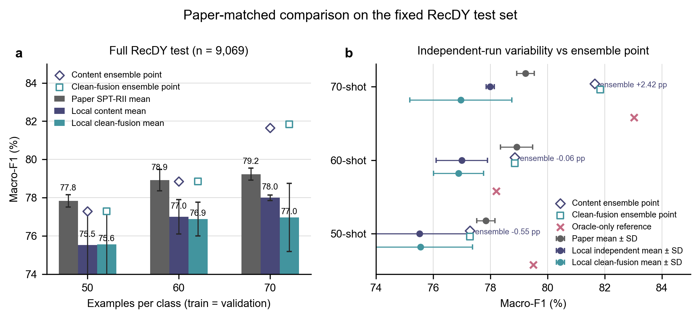
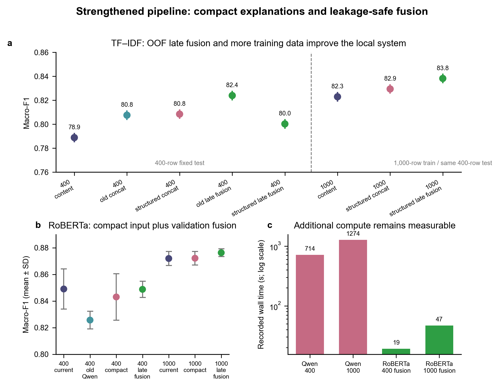
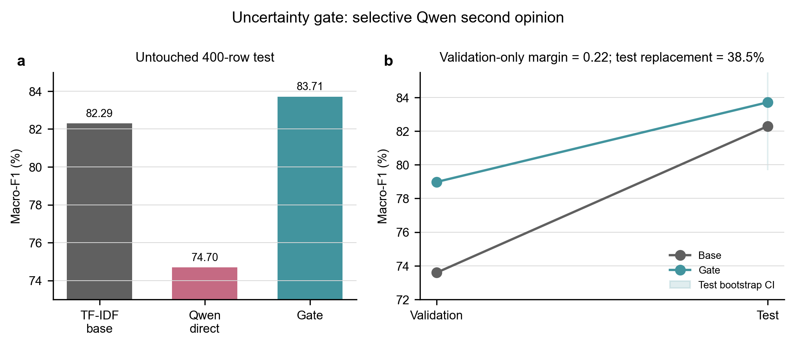

# 提升数据与原论文逐项对比

> 说明：本 Markdown 是 2026-07-18 的历史快照。当前权威版本是同目录的
> `improvement_comparison.tex` 与 `提升数据与原论文逐项对比.pdf`（2026-07-19）。
> 下方旧的 81.65% 结果保留作审计记录；新的严格同标签预算主结果见下一节。

## 当前严格同标签预算主结果（2026-07-19）

固定同一份每类 70 条训练和每类 70 条验证标签，五个成员只改变初始化/Dropout；完整 RecDY 测试集为 9,069 条。

| 条件 | 五初始化均值 Macro-F1 | 同标签五模型集成 | 相对论文 79.23% |
|---|---:|---:|---:|
| 基础 RoBERTa + CE | 77.61 ± 1.44% | 79.15% | -0.08 pp |
| DAPT + CE | 79.23 ± 1.07% | 80.45% | +1.22 pp |
| 基础 RoBERTa + R-Drop | 77.77 ± 1.12% | 79.38% | +0.15 pp |
| DAPT + R-Drop | **80.01 ± 0.62%** | **80.60%** | **+1.37 pp** |

DAPT 只读取训练分区的 21,159 条无标签弹幕；R-Drop 使用两次 dropout 前向。相对固定 split 基线集成的提升为 +1.45 pp，逐行 bootstrap 95% CI 为 [+0.85, +2.06] pp，按直播间聚类为 [+0.77, +2.45] pp。人工标签预算没有增加，但无标签文本和五模型计算增加，因此这是受控的描述性进步，不是完整 SPT-RII 复现或同总资源预算胜出。

## 一句话结论

本地与原论文 Table 5 最接近的 70-shot/类独立运行结果为 **78.00±0.14%**，比论文 **79.23±0.31%** 低 **1.23 pp**。三种子内容概率集成达到 **81.65%**，描述性高 **2.42 pp**；但三个成员重新抽样，训练并集为 420 条，因此不能解释为同预算 70-shot 单模型超过论文。

## 比较口径

- 原论文位置：§6.5，Table 5，PDF/印刷 p.14，source_map T001。
- 本地固定测试集：RecDY，n=9,069；种子 100/101/102；测试集零调参。
- 原文仅写 F1/Prec./Rec.，未明确 averaging；本地采用 Macro-F1/Macro-Precision/Macro-Recall。
- 本地未复现 soft prompt、BiLSTM prompt interaction 和动态 verbalizer，是低成本替代路线。

## Table 5 主对比

| shot/类 | 论文 SPT-RII F1±SD | 本地独立 Macro-F1±SD | 差值 | 内容集成单点 | 差值 | 内容+字符集成单点 |
|---:|---:|---:|---:|---:|---:|---:|
| 50 | 77.84% ± 0.32% | 75.52% ± 1.67% | -2.32 pp | 77.29% | -0.55 pp | 77.29% |
| 60 | 78.92% ± 0.56% | 77.00% ± 0.89% | -1.92 pp | 78.86% | -0.06 pp | 78.86% |
| 70 | 79.23% ± 0.31% | 78.00% ± 0.14% | -1.23 pp | 81.65% | +2.42 pp | 81.85% |

工程集成预算：50/60/70-shot 每成员训练总数为 100/120/140，三个成员训练并集分别为 299/360/420；训练+验证总并集为 592/713/824。

## 内部提升：协议不同，不与 Table 5 直接相减

| 路线 | 基线 | 改进 | 变化 | 说明 |
|---|---:|---:|---:|---|
| TF-IDF，1000 训练 | 82.29% | 83.82% | +1.53 pp | 结构化解释 + OOF late fusion；95% CI [-1.28,+4.34] |
| RoBERTa，1000 训练 | 87.19±0.53% | 87.63±0.29% | +0.43 pp | compact late fusion；三个种子均为正 |
| 不确定性门控 | 82.29% | 83.71% | +1.42 pp | 38.5% 路由；95% CI [-2.61,+5.37] |

原论文对应位置：解释生成见 §5.3（pp.9–10）；消融见 §6.6/Fig.6（p.15）；大模型比较见 §6.7/Table 6（p.16）；效率见 §6.10/Table 9（p.17）。这些是概念对应，不是同协议数值比较。

## 原论文覆盖矩阵

| 原论文位置 | 本地覆盖 | 结论用途 |
|---|---|---|
| §6.5 / Table 5 / p.14 | 直接协议对齐 | 主对比 |
| §6.6 / Fig.6 / p.15 | 组件思想对应 | 解释/融合动机 |
| §6.7 / Table 6 / p.16 | 概念对应 | 门控，不直接相减 |
| §6.10 / Table 9 / p.17 | 描述性对照 | 4060 可运行与成本 |
| §6.12 / Fig.9 / pp.19–20 | 设计依据 | 压缩上下文 |
| Table 7/8/10/11、Fig.8 | 未覆盖 | 不参与结论 |

## 关键限制

1. 论文没有明确 F1 averaging，也没有在正文明确 shot 是“每类”还是“总数”；本地依据公开代码按每类执行。
2. 三模型工程集成扩大了累计标注覆盖，必须与独立运行均值分开。
3. 12 个 live_id 同时出现在训练/测试；尚未证明跨直播间泛化。
4. 解释实验存在同一直播流的跨 split 上下文，无金标签泄漏，但属于转导式信息。
5. 内部测试仅 400 条，多个置信区间跨 0，不应使用“统计显著”表述。

## 证据入口

- `E:\Lab\experiment\results\paper_comparison\paper_vs_local_comparison.csv`
- `E:\Lab\experiment\results\paper_comparison\paper_matched_manifest.json`
- `E:\Lab\experiment\results\improvement\classical_improvement_summary.csv`
- `E:\Lab\experiment\results\improvement\roberta_improvement_summary.csv`
- `E:\Lab\experiment\results\improvement\uncertainty_gate.json`
- `E:\Lab\experiment\paper_reader\source_map.json`
- `E:\Lab\experiment\report\report.pdf`
